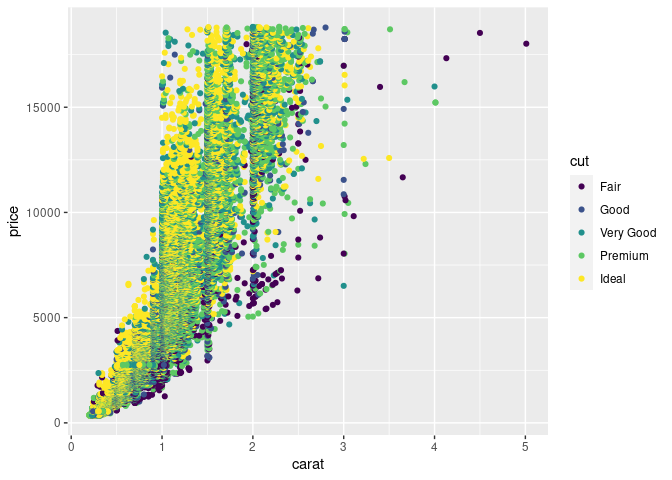
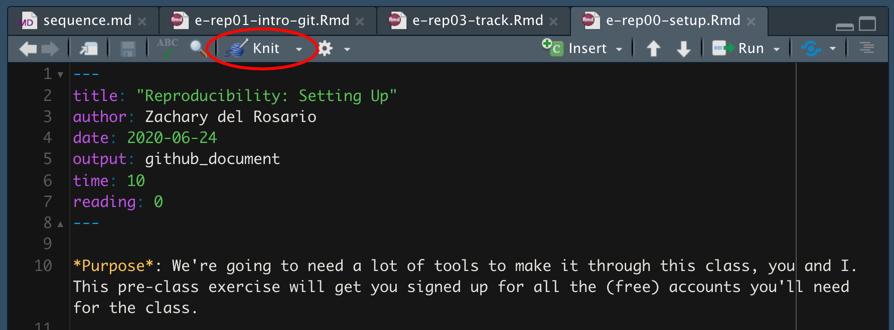

Getting Started: Diamonds
================
Brooke Moss
2023-01-23

- <a href="#grading-rubric" id="toc-grading-rubric">Grading Rubric</a>
  - <a href="#individual" id="toc-individual">Individual</a>
  - <a href="#submission" id="toc-submission">Submission</a>
- <a href="#data-exploration" id="toc-data-exploration">Data
  Exploration</a>
  - <a
    href="#q1-create-a-plot-of-price-vs-carat-of-the-diamonds-dataset-below-document-your-observations-from-the-visual"
    id="toc-q1-create-a-plot-of-price-vs-carat-of-the-diamonds-dataset-below-document-your-observations-from-the-visual"><strong>q1</strong>
    Create a plot of <code>price</code> vs <code>carat</code> of the
    <code>diamonds</code> dataset below. Document your observations from the
    visual.</a>
  - <a
    href="#q2-create-a-visualization-showing-variables-carat-price-and-cut-simultaneously-experiment-with-which-variable-you-assign-to-which-aesthetic-x-y-etc-to-find-an-effective-visual"
    id="toc-q2-create-a-visualization-showing-variables-carat-price-and-cut-simultaneously-experiment-with-which-variable-you-assign-to-which-aesthetic-x-y-etc-to-find-an-effective-visual"><strong>q2</strong>
    Create a visualization showing variables <code>carat</code>,
    <code>price</code>, and <code>cut</code> simultaneously. Experiment with
    which variable you assign to which aesthetic (<code>x</code>,
    <code>y</code>, etc.) to find an effective visual.</a>
- <a href="#communication" id="toc-communication">Communication</a>
  - <a href="#q3-knit-your-document-in-order-to-create-a-report"
    id="toc-q3-knit-your-document-in-order-to-create-a-report"><strong>q3</strong>
    <em>Knit</em> your document in order to create a report.</a>
  - <a href="#q4-push-your-knitted-document-to-github"
    id="toc-q4-push-your-knitted-document-to-github"><strong>q4</strong>
    <em>Push</em> your knitted document to GitHub.</a>
  - <a href="#q5-submit-your-work-to-canvas"
    id="toc-q5-submit-your-work-to-canvas"><strong>q5</strong>
    <em>Submit</em> your work to Canvas</a>
  - <a href="#q6-prepare-to-present-your-teams-findings"
    id="toc-q6-prepare-to-present-your-teams-findings"><strong>q6</strong>
    <em>Prepare</em> to present your team’s findings!</a>

*Purpose*: Throughout this course, you’ll complete a large number of
*exercises* and *challenges*. Exercises are meant to introduce content
with easy-to-solve problems, while challenges are meant to make you
think more deeply about and apply the content. The challenges will start
out highly-scaffolded, and become progressively open-ended.

In this challenge, you will go through the process of exploring,
documenting, and sharing an analysis of a dataset. We will use these
skills again and again in each challenge.

*Note*: You will have seen all of these steps in `e-vis00-basics`. This
challenge is *primarily* a practice run of the submission system. The
Data Exploration part should be very simple.

<!-- include-rubric -->

# Grading Rubric

<!-- -------------------------------------------------- -->

Unlike exercises, **challenges will be graded**. The following rubrics
define how you will be graded, both on an individual and team basis.

## Individual

<!-- ------------------------- -->

| Category    | Needs Improvement                                                                                                | Satisfactory                                                                                                               |
|-------------|------------------------------------------------------------------------------------------------------------------|----------------------------------------------------------------------------------------------------------------------------|
| Effort      | Some task **q**’s left unattempted                                                                               | All task **q**’s attempted                                                                                                 |
| Observed    | Did not document observations, or observations incorrect                                                         | Documented correct observations based on analysis                                                                          |
| Supported   | Some observations not clearly supported by analysis                                                              | All observations clearly supported by analysis (table, graph, etc.)                                                        |
| Assessed    | Observations include claims not supported by the data, or reflect a level of certainty not warranted by the data | Observations are appropriately qualified by the quality & relevance of the data and (in)conclusiveness of the support      |
| Specified   | Uses the phrase “more data are necessary” without clarification                                                  | Any statement that “more data are necessary” specifies which *specific* data are needed to answer what *specific* question |
| Code Styled | Violations of the [style guide](https://style.tidyverse.org/) hinder readability                                 | Code sufficiently close to the [style guide](https://style.tidyverse.org/)                                                 |

## Submission

<!-- ------------------------- -->

Make sure to commit both the challenge report (`report.md` file) and
supporting files (`report_files/` folder) when you are done! Then submit
a link to Canvas. **Your Challenge submission is not complete without
all files uploaded to GitHub.**

``` r
library(tidyverse)
```

    ## ── Attaching packages ─────────────────────────────────────── tidyverse 1.3.2 ──
    ## ✔ ggplot2 3.4.0      ✔ purrr   1.0.1 
    ## ✔ tibble  3.1.8      ✔ dplyr   1.0.10
    ## ✔ tidyr   1.2.1      ✔ stringr 1.5.0 
    ## ✔ readr   2.1.3      ✔ forcats 0.5.2 
    ## ── Conflicts ────────────────────────────────────────── tidyverse_conflicts() ──
    ## ✖ dplyr::filter() masks stats::filter()
    ## ✖ dplyr::lag()    masks stats::lag()

# Data Exploration

<!-- -------------------------------------------------- -->

In this first stage, you will explore the `diamonds` dataset and
document your observations.

### **q1** Create a plot of `price` vs `carat` of the `diamonds` dataset below. Document your observations from the visual.

*Hint*: We learned how to do this in `e-vis00-basics`!

``` r
## TASK: Plot `price` vs `carat` below
## Your code here!
ggplot(diamonds) +
  geom_point(mapping = aes(
    x = carat,
    y = price
  ))
```

<!-- -->

**Observations**:

- There is a distinct positive correlation between price and carat.
- The middle carat values seem to greater price variation, likely due to
  the other quality measures.
- The data is very crowded, I imagine once there is more differentiation
  between the data points it will be difficult to make out that is going
  on.

### **q2** Create a visualization showing variables `carat`, `price`, and `cut` simultaneously. Experiment with which variable you assign to which aesthetic (`x`, `y`, etc.) to find an effective visual.

``` r
## TASK: Plot `price`, `carat`, and `cut` below
## Your code here!
ggplot(diamonds) +
  geom_point(mapping = aes(
    x = carat,
    y = price,
    color = cut
  ))
```

<!-- -->

**Observations**:

- I kept price and carat on the axes because putting a non-continuous
  value attribute (like `cut`) on either axis made the data into a weird
  set of bars.
- Visualizing the `cut` as either size or shape made the plot
  unreadable, so color made the most sense.

# Communication

<!-- -------------------------------------------------- -->

In this next stage, you will render your data exploration, push it to
GitHub to share with others, and link your observations within our [Data
Science
Wiki](https://olin-data-science.fandom.com/wiki/Olin_Data_Science_Wiki).

### **q3** *Knit* your document in order to create a report.

You can do this by clicking the “Knit” button at the top of your
document in RStudio.



This will create a local `.md` file, and RStudio will automatically open
a preview window so you can view your knitted document.

### **q4** *Push* your knitted document to GitHub.


You will need to stage both the `.md` file, as well as the `_files`
folder. Note that the `_files` folder, when staged, will expand to
include all the files under that directory.


### **q5** *Submit* your work to Canvas

Navigate to your GitHub repository’s website and find the URL that
corresponds to your report. Submit this to Canvas to complete the
assignment.

### **q6** *Prepare* to present your team’s findings!

If your team is on-deck, you are responsible for putting together a
discussion of the challenge. I’ll demonstrate how to do this by leading
the discussion of Challenge 0.
