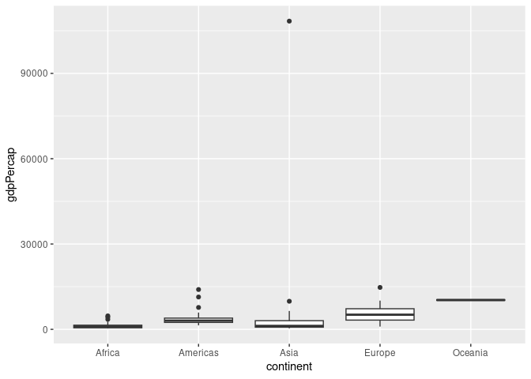
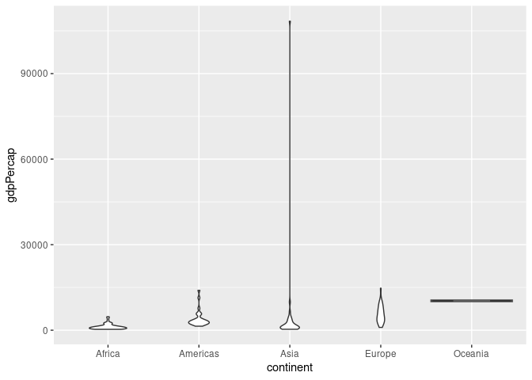
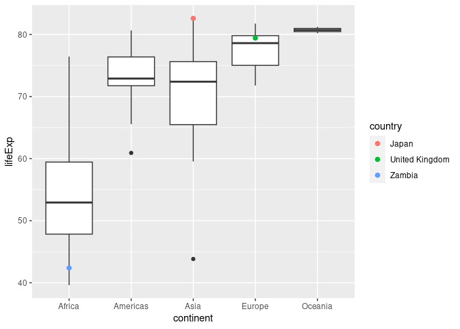
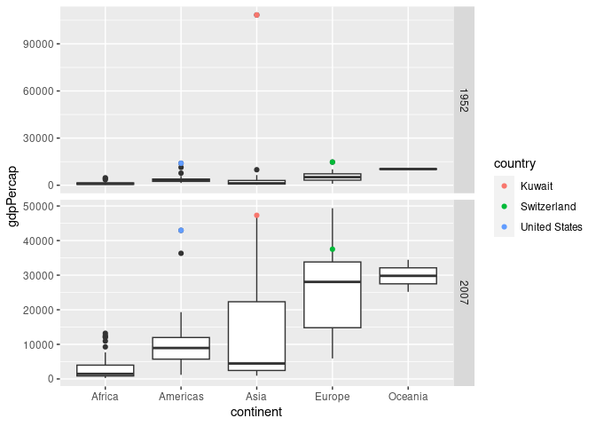
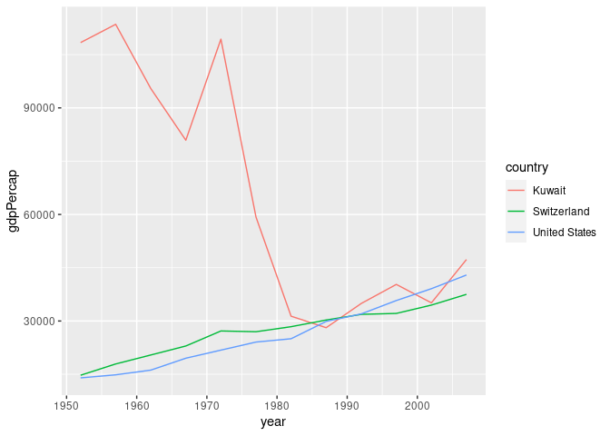
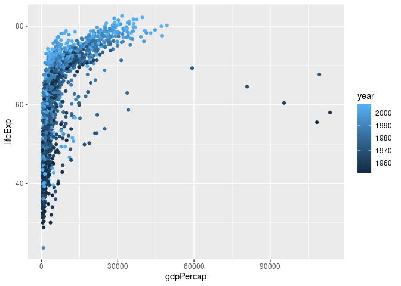
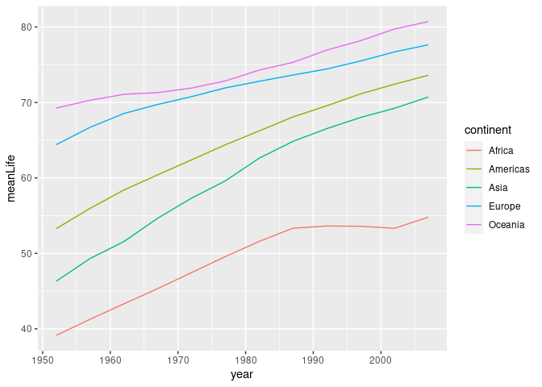

Gapminder
================
Brooke Moss
2023-02-22

- <a href="#grading-rubric" id="toc-grading-rubric">Grading Rubric</a>
  - <a href="#individual" id="toc-individual">Individual</a>
  - <a href="#due-date" id="toc-due-date">Due Date</a>
- <a href="#guided-eda" id="toc-guided-eda">Guided EDA</a>
  - <a
    href="#q0-perform-your-first-checks-on-the-dataset-what-variables-are-in-this-dataset"
    id="toc-q0-perform-your-first-checks-on-the-dataset-what-variables-are-in-this-dataset"><strong>q0</strong>
    Perform your “first checks” on the dataset. What variables are in this
    dataset?</a>
  - <a
    href="#q1-determine-the-most-and-least-recent-years-in-the-gapminder-dataset"
    id="toc-q1-determine-the-most-and-least-recent-years-in-the-gapminder-dataset"><strong>q1</strong>
    Determine the most and least recent years in the <code>gapminder</code>
    dataset.</a>
  - <a
    href="#q2-filter-on-years-matching-year_min-and-make-a-plot-of-the-gdp-per-capita-against-continent-choose-an-appropriate-geom_-to-visualize-the-data-what-observations-can-you-make"
    id="toc-q2-filter-on-years-matching-year_min-and-make-a-plot-of-the-gdp-per-capita-against-continent-choose-an-appropriate-geom_-to-visualize-the-data-what-observations-can-you-make"><strong>q2</strong>
    Filter on years matching <code>year_min</code>, and make a plot of the
    GDP per capita against continent. Choose an appropriate
    <code>geom_</code> to visualize the data. What observations can you
    make?</a>
  - <a
    href="#q3-you-should-have-found-at-least-three-outliers-in-q2-but-possibly-many-more-identify-those-outliers-figure-out-which-countries-they-are"
    id="toc-q3-you-should-have-found-at-least-three-outliers-in-q2-but-possibly-many-more-identify-those-outliers-figure-out-which-countries-they-are"><strong>q3</strong>
    You should have found <em>at least</em> three outliers in q2 (but
    possibly many more!). Identify those outliers (figure out which
    countries they are).</a>
  - <a
    href="#q4-create-a-plot-similar-to-yours-from-q2-studying-both-year_min-and-year_max-find-a-way-to-highlight-the-outliers-from-q3-on-your-plot-in-a-way-that-lets-you-identify-which-country-is-which-compare-the-patterns-between-year_min-and-year_max"
    id="toc-q4-create-a-plot-similar-to-yours-from-q2-studying-both-year_min-and-year_max-find-a-way-to-highlight-the-outliers-from-q3-on-your-plot-in-a-way-that-lets-you-identify-which-country-is-which-compare-the-patterns-between-year_min-and-year_max"><strong>q4</strong>
    Create a plot similar to yours from q2 studying both
    <code>year_min</code> and <code>year_max</code>. Find a way to highlight
    the outliers from q3 on your plot <em>in a way that lets you identify
    which country is which</em>. Compare the patterns between
    <code>year_min</code> and <code>year_max</code>.</a>
- <a href="#your-own-eda" id="toc-your-own-eda">Your Own EDA</a>
  - <a
    href="#q5-create-at-least-three-new-figures-below-with-each-figure-try-to-pose-new-questions-about-the-data"
    id="toc-q5-create-at-least-three-new-figures-below-with-each-figure-try-to-pose-new-questions-about-the-data"><strong>q5</strong>
    Create <em>at least</em> three new figures below. With each figure, try
    to pose new questions about the data.</a>

*Purpose*: Learning to do EDA well takes practice! In this challenge
you’ll further practice EDA by first completing a guided exploration,
then by conducting your own investigation. This challenge will also give
you a chance to use the wide variety of visual tools we’ve been
learning.

<!-- include-rubric -->

# Grading Rubric

<!-- -------------------------------------------------- -->

Unlike exercises, **challenges will be graded**. The following rubrics
define how you will be graded, both on an individual and team basis.

## Individual

<!-- ------------------------- -->

| Category    | Needs Improvement                                                                                                | Satisfactory                                                                                                               |
|-------------|------------------------------------------------------------------------------------------------------------------|----------------------------------------------------------------------------------------------------------------------------|
| Effort      | Some task **q**’s left unattempted                                                                               | All task **q**’s attempted                                                                                                 |
| Observed    | Did not document observations, or observations incorrect                                                         | Documented correct observations based on analysis                                                                          |
| Supported   | Some observations not clearly supported by analysis                                                              | All observations clearly supported by analysis (table, graph, etc.)                                                        |
| Assessed    | Observations include claims not supported by the data, or reflect a level of certainty not warranted by the data | Observations are appropriately qualified by the quality & relevance of the data and (in)conclusiveness of the support      |
| Specified   | Uses the phrase “more data are necessary” without clarification                                                  | Any statement that “more data are necessary” specifies which *specific* data are needed to answer what *specific* question |
| Code Styled | Violations of the [style guide](https://style.tidyverse.org/) hinder readability                                 | Code sufficiently close to the [style guide](https://style.tidyverse.org/)                                                 |

## Due Date

<!-- ------------------------- -->

All the deliverables stated in the rubrics above are due **at midnight**
before the day of the class discussion of the challenge. See the
[Syllabus](https://docs.google.com/document/d/1qeP6DUS8Djq_A0HMllMqsSqX3a9dbcx1/edit?usp=sharing&ouid=110386251748498665069&rtpof=true&sd=true)
for more information.

``` r
library(tidyverse)
```

    ## ── Attaching packages ─────────────────────────────────────── tidyverse 1.3.2 ──
    ## ✔ ggplot2 3.4.0      ✔ purrr   1.0.1 
    ## ✔ tibble  3.1.8      ✔ dplyr   1.0.10
    ## ✔ tidyr   1.2.1      ✔ stringr 1.5.0 
    ## ✔ readr   2.1.3      ✔ forcats 0.5.2 
    ## ── Conflicts ────────────────────────────────────────── tidyverse_conflicts() ──
    ## ✖ dplyr::filter() masks stats::filter()
    ## ✖ dplyr::lag()    masks stats::lag()

``` r
library(gapminder)
```

*Background*: [Gapminder](https://www.gapminder.org/about-gapminder/) is
an independent organization that seeks to educate people about the state
of the world. They seek to counteract the worldview constructed by a
hype-driven media cycle, and promote a “fact-based worldview” by
focusing on data. The dataset we’ll study in this challenge is from
Gapminder.

# Guided EDA

<!-- -------------------------------------------------- -->

First, we’ll go through a round of *guided EDA*. Try to pay attention to
the high-level process we’re going through—after this guided round
you’ll be responsible for doing another cycle of EDA on your own!

### **q0** Perform your “first checks” on the dataset. What variables are in this dataset?

``` r
## TASK: Do your "first checks" here!
gapminder
```

    ## # A tibble: 1,704 × 6
    ##    country     continent  year lifeExp      pop gdpPercap
    ##    <fct>       <fct>     <int>   <dbl>    <int>     <dbl>
    ##  1 Afghanistan Asia       1952    28.8  8425333      779.
    ##  2 Afghanistan Asia       1957    30.3  9240934      821.
    ##  3 Afghanistan Asia       1962    32.0 10267083      853.
    ##  4 Afghanistan Asia       1967    34.0 11537966      836.
    ##  5 Afghanistan Asia       1972    36.1 13079460      740.
    ##  6 Afghanistan Asia       1977    38.4 14880372      786.
    ##  7 Afghanistan Asia       1982    39.9 12881816      978.
    ##  8 Afghanistan Asia       1987    40.8 13867957      852.
    ##  9 Afghanistan Asia       1992    41.7 16317921      649.
    ## 10 Afghanistan Asia       1997    41.8 22227415      635.
    ## # … with 1,694 more rows

``` r
summary(gapminder)
```

    ##         country        continent        year         lifeExp     
    ##  Afghanistan:  12   Africa  :624   Min.   :1952   Min.   :23.60  
    ##  Albania    :  12   Americas:300   1st Qu.:1966   1st Qu.:48.20  
    ##  Algeria    :  12   Asia    :396   Median :1980   Median :60.71  
    ##  Angola     :  12   Europe  :360   Mean   :1980   Mean   :59.47  
    ##  Argentina  :  12   Oceania : 24   3rd Qu.:1993   3rd Qu.:70.85  
    ##  Australia  :  12                  Max.   :2007   Max.   :82.60  
    ##  (Other)    :1632                                                
    ##       pop              gdpPercap       
    ##  Min.   :6.001e+04   Min.   :   241.2  
    ##  1st Qu.:2.794e+06   1st Qu.:  1202.1  
    ##  Median :7.024e+06   Median :  3531.8  
    ##  Mean   :2.960e+07   Mean   :  7215.3  
    ##  3rd Qu.:1.959e+07   3rd Qu.:  9325.5  
    ##  Max.   :1.319e+09   Max.   :113523.1  
    ## 

**Observations**:

- country
- continent
- year
- lifeExp
- pop
- gdpPercap

### **q1** Determine the most and least recent years in the `gapminder` dataset.

*Hint*: Use the `pull()` function to get a vector out of a tibble.
(Rather than the `$` notation of base R.)

``` r
## TASK: Find the largest and smallest values of `year` in `gapminder`
year_max <- max(pull(gapminder, year))
year_min <- min(pull(gapminder, year))
```

Use the following test to check your work.

``` r
## NOTE: No need to change this
assertthat::assert_that(year_max %% 7 == 5)
```

    ## [1] TRUE

``` r
assertthat::assert_that(year_max %% 3 == 0)
```

    ## [1] TRUE

``` r
assertthat::assert_that(year_min %% 7 == 6)
```

    ## [1] TRUE

``` r
assertthat::assert_that(year_min %% 3 == 2)
```

    ## [1] TRUE

``` r
if (is_tibble(year_max)) {
  print("year_max is a tibble; try using `pull()` to get a vector")
  assertthat::assert_that(False)
}

print("Nice!")
```

    ## [1] "Nice!"

### **q2** Filter on years matching `year_min`, and make a plot of the GDP per capita against continent. Choose an appropriate `geom_` to visualize the data. What observations can you make?

You may encounter difficulties in visualizing these data; if so document
your challenges and attempt to produce the most informative visual you
can.

``` r
## TASK: Create a visual of gdpPercap vs continent

# Final Plot
gapminder %>%
  filter(year == year_min) %>%
  ggplot() +
  geom_boxplot(mapping = aes(
    x = continent,
    y = gdpPercap,
  )) +  coord_cartesian(ylim = c(0, 20000))
```

<!-- -->

``` r
# Second Try
gapminder %>%
  filter(year == year_min) %>%
  ggplot() +
  geom_boxplot(mapping = aes(
    x = continent,
    y = gdpPercap,
  ))
```

<!-- -->

``` r
# First Try
gapminder %>%
  filter(year == year_min) %>%
  ggplot() +
  geom_violin(mapping = aes(
    x = continent,
    y = gdpPercap,
  ))
```

<!-- -->

**Observations**:

- One data point within the Asian continent is astronomically higher
  than all of the other datapoints, I wonder which country that is.

**Difficulties & Approaches**:

- Initial plot (violin) had such a long bar for Asia that the rest of
  the plot was unreadably tiny at the bottom.
- Taking the boxplot instead of the violin gives a somewhat better view
  of the data, but the outlier still makes the rest of the plot
  difficult to understand.
- By utilizing `coord_cartesian` to limit the y axis, I cut out the one
  extreme outlier and the rest of the data looks much more reasonable.

### **q3** You should have found *at least* three outliers in q2 (but possibly many more!). Identify those outliers (figure out which countries they are).

``` r
## TASK: Identify the outliers from q2
gapminder %>%
  filter(year == year_min) %>%
  group_by(continent) %>%
  filter(continent != "Oceania") %>%
  filter(gdpPercap < quantile(gdpPercap, 0.01) | gdpPercap > quantile(gdpPercap, 0.99))
```

    ## # A tibble: 8 × 6
    ## # Groups:   continent [4]
    ##   country                continent  year lifeExp       pop gdpPercap
    ##   <fct>                  <fct>     <int>   <dbl>     <int>     <dbl>
    ## 1 Bosnia and Herzegovina Europe     1952    53.8   2791000      974.
    ## 2 Dominican Republic     Americas   1952    45.9   2491346     1398.
    ## 3 Kuwait                 Asia       1952    55.6    160000   108382.
    ## 4 Lesotho                Africa     1952    42.1    748747      299.
    ## 5 Myanmar                Asia       1952    36.3  20092996      331 
    ## 6 South Africa           Africa     1952    45.0  14264935     4725.
    ## 7 Switzerland            Europe     1952    69.6   4815000    14734.
    ## 8 United States          Americas   1952    68.4 157553000    13990.

**Observations**:

- Identify the outlier countries from q2
  - Kuwait
  - United States
  - Switzerland

*Hint*: For the next task, it’s helpful to know a ggplot trick we’ll
learn in an upcoming exercise: You can use the `data` argument inside
any `geom_*` to modify the data that will be plotted *by that geom
only*. For instance, you can use this trick to filter a set of points to
label:

``` r
## NOTE: No need to edit, use ideas from this in q4 below
gapminder %>%
  filter(year == max(year)) %>%

  ggplot(aes(continent, lifeExp)) +
  geom_boxplot() +
  geom_point(
    data = . %>% filter(country %in% c("United Kingdom", "Japan", "Zambia")),
    mapping = aes(color = country),
    size = 2
  )
```

<!-- -->

### **q4** Create a plot similar to yours from q2 studying both `year_min` and `year_max`. Find a way to highlight the outliers from q3 on your plot *in a way that lets you identify which country is which*. Compare the patterns between `year_min` and `year_max`.

*Hint*: We’ve learned a lot of different ways to show multiple
variables; think about using different aesthetics or facets.

``` r
## TASK: Create a visual of gdpPercap vs continent
gapminder %>%
  filter(year %in% c(year_min, year_max)) %>%
  ggplot(aes(x = continent, y = gdpPercap)) +
  geom_boxplot() +
  facet_grid(rows = vars(year), scales = "free") +
  geom_point(
    data = . %>% filter(country %in% c("Kuwait", "United States", "Switzerland")),
    mapping = aes(color = country)
  )
```

<!-- -->

**Observations**:

- All 3 1952 outlier countries are still at or near the top of the GDP
  per capita for their respective continents.
- However, Kuwait in particular more than halved their GDP per capita,
  leading them to now be much closer to the rest of the Asian
  distribution.
- Switzerland is no longer the extreme outlier for Europe, rather being
  above the 75th percentile but not 99th.
- The United States is still the highest in the Americas, and their GDP
  per capita has actually increased significantly, although they appear
  to be about at the same point relative to the Americas distribution as
  they were in 1952.

# Your Own EDA

<!-- -------------------------------------------------- -->

Now it’s your turn! We just went through guided EDA considering the GDP
per capita at two time points. You can continue looking at outliers,
consider different years, repeat the exercise with `lifeExp`, consider
the relationship between variables, or something else entirely.

### **q5** Create *at least* three new figures below. With each figure, try to pose new questions about the data.

``` r
## TASK: Your first graph
gapminder %>%
  filter(country %in% c("Kuwait", "United States", "Switzerland")) %>%
  ggplot(aes(x = year, y = gdpPercap)) +
  geom_line(mapping = aes(color = country))
```

<!-- -->

- Although I already visualized the GDP per capita of the 3 outlier
  countries (USA, Kuwait, Switzerland) in both 1952 and 2007, I thought
  it would be useful to visualize their progression throughout the
  years.
- From this plot, I can see that the USA and Switzerland seem to follow
  a very similar trajectory, perhaps indicative of a general trend in
  the international economy. After about 1980-1985, Kuwait also follows
  this trend.
- The massive drop in Kuwait’s economy between 1973 and 1985 coincides
  perfectly with the aftermath of the 1973 Oil Crisis, which tanked
  Kuwait’s oil-dependent economy.

``` r
## TASK: Your second graph
gapminder %>%
  # filter(country %in% c("Kuwait", "United States", "Switzerland")) %>%
  ggplot(aes(x = gdpPercap, y = lifeExp)) +
  geom_point(mapping = aes(color = year))
```

<!-- -->

``` r
gapminder %>%
  arrange(lifeExp)
```

    ## # A tibble: 1,704 × 6
    ##    country      continent  year lifeExp     pop gdpPercap
    ##    <fct>        <fct>     <int>   <dbl>   <int>     <dbl>
    ##  1 Rwanda       Africa     1992    23.6 7290203      737.
    ##  2 Afghanistan  Asia       1952    28.8 8425333      779.
    ##  3 Gambia       Africa     1952    30    284320      485.
    ##  4 Angola       Africa     1952    30.0 4232095     3521.
    ##  5 Sierra Leone Africa     1952    30.3 2143249      880.
    ##  6 Afghanistan  Asia       1957    30.3 9240934      821.
    ##  7 Cambodia     Asia       1977    31.2 6978607      525.
    ##  8 Mozambique   Africa     1952    31.3 6446316      469.
    ##  9 Sierra Leone Africa     1957    31.6 2295678     1004.
    ## 10 Burkina Faso Africa     1952    32.0 4469979      543.
    ## # … with 1,694 more rows

- Apart from being accidentally very pretty, this plot allows me to see
  a correlation between GDP per capita and life expectancy.
- It is apparent that the highest life expectancy countries have
  relatively high GDP per capita. There are a few outlier countries with
  extremely high GDP that buck this trend, but these are likely
  autocracies (such as the Kuwaiti oil state) where wealth is
  concentrated in the leadership and therefore the population doesn’t
  see life expectancy increases from the wealth.
- In addition, I see that the coloration by year shows a stark increase
  in life expectancy overall as time goes on. Almost all of the
  high-life expectancy points are from recent years.
- I do notice one point at the very bottom left of the plot that is very
  recent and wonder what country it might be and whether its decline
  relates to some world events.
  - After further investigation (sorting the table by lowest life
    expectancy), this lowest value seems to be from 1992 in Rwanda,
    which was during the Rwandan civil war (and just 2 years before what
    is commonly referred to as the Rwandan genocide).

``` r
## TASK: Your third graph
gapminder %>%
  group_by(continent, year) %>%
  summarize(meanLife = mean(lifeExp)) %>%
  ggplot(aes(x = year, y = meanLife)) +
  geom_line(aes(color = continent))
```

    ## `summarise()` has grouped output by 'continent'. You can override using the
    ## `.groups` argument.

<!-- -->

- This plot gives a relatively simple representation of life expectancy
  in each continent over time. Each line is the mean of that continent’s
  life expectancy over time.
- I notice that between 1986 and 2002, the African life expectancy
  leveled off, while the other continents seemed to continue climbing.
