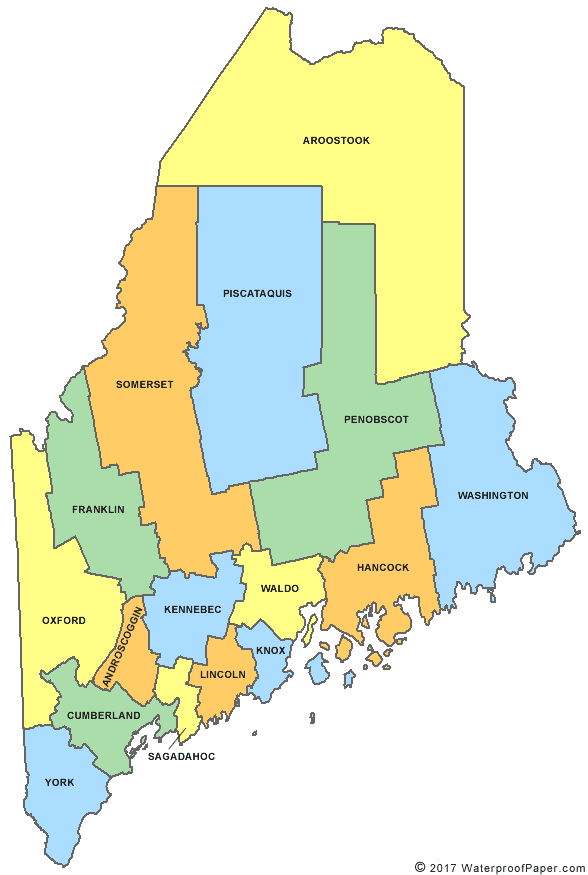

*Purpose*: In this challenge, you'll learn how to navigate the U.S.
Census Bureau website, programmatically download data from the internet,
and perform a county-level population-weighted analysis of current
COVID-19 trends. This will give you the base for a very deep
investigation of COVID-19, which we'll build upon for Project 1.

<!-- include-rubric -->

# Grading Rubric

<!-- -------------------------------------------------- -->

Unlike exercises, **challenges will be graded**. The following rubrics
define how you will be graded, both on an individual and team basis.

## Individual

<!-- ------------------------- -->

| Category    | Needs Improvement                                                                                                | Satisfactory                                                                                                               |
|--------------|----------------------------|-------------------------------|
| Effort      | Some task **q**'s left unattempted                                                                               | All task **q**'s attempted                                                                                                 |
| Observed    | Did not document observations, or observations incorrect                                                         | Documented correct observations based on analysis                                                                          |
| Supported   | Some observations not clearly supported by analysis                                                              | All observations clearly supported by analysis (table, graph, etc.)                                                        |
| Assessed    | Observations include claims not supported by the data, or reflect a level of certainty not warranted by the data | Observations are appropriately qualified by the quality & relevance of the data and (in)conclusiveness of the support      |
| Specified   | Uses the phrase "more data are necessary" without clarification                                                  | Any statement that "more data are necessary" specifies which *specific* data are needed to answer what *specific* question |
| Code Styled | Violations of the [style guide](https://style.tidyverse.org/) hinder readability                                 | Code sufficiently close to the [style guide](https://style.tidyverse.org/)                                                 |

## Due Date

<!-- ------------------------- -->

All the deliverables stated in the rubrics above are due **at midnight**
before the day of the class discussion of the challenge. See the
[Syllabus](https://docs.google.com/document/d/1qeP6DUS8Djq_A0HMllMqsSqX3a9dbcx1/edit?usp=sharing&ouid=110386251748498665069&rtpof=true&sd=true)
for more information.

```{r setup}
library(tidyverse)

```

*Background*:
[COVID-19](https://en.wikipedia.org/wiki/Coronavirus_disease_2019) is
the disease caused by the virus SARS-CoV-2. In 2020 it became a global
pandemic, leading to huge loss of life and tremendous disruption to
society. The New York Times (as of writing) publishes up-to-date data on
the progression of the pandemic across the United States---we will study
these data in this challenge.

*Optional Readings*: I've found this [ProPublica
piece](https://www.propublica.org/article/how-to-understand-covid-19-numbers)
on "How to understand COVID-19 numbers" to be very informative!

# The Big Picture

<!-- -------------------------------------------------- -->

We're about to go through *a lot* of weird steps, so let's first fix the
big picture firmly in mind:

We want to study COVID-19 in terms of data: both case counts (number of
infections) and deaths. We're going to do a county-level analysis in
order to get a high-resolution view of the pandemic. Since US counties
can vary widely in terms of their population, we'll need population
estimates in order to compute infection rates (think back to the
`Titanic` challenge).

That's the high-level view; now let's dig into the details.

# Get the Data

<!-- -------------------------------------------------- -->

1.  County-level population estimates (Census Bureau)
2.  County-level COVID-19 counts (New York Times)

## Navigating the Census Bureau

<!-- ------------------------- -->

**Steps**: Our objective is to find the 2018 American Community
Survey[1] (ACS) Total Population estimates, disaggregated by counties.
To check your results, this is Table `B01003`.

1.  Go to [data.census.gov](data.census.gov).
2.  Scroll down and click `View Tables`.
3.  Apply filters to find the ACS **Total Population** estimates,
    disaggregated by counties. I used the filters:

-   `Topics > Populations and People > Counts, Estimates, and Projections > Population Total`
-   `Geography > County > All counties in United States`

5.  Select the **Total Population** table and click the `Download`
    button to download the data; make sure to select the 2018 5-year
    estimates.
6.  Unzip and move the data to your `challenges/data` folder.

-   Note that the data will have a crazy-long filename like
    `ACSDT5Y2018.B01003_data_with_overlays_2020-07-26T094857.csv`.
    That's because metadata is stored in the filename, such as the year
    of the estimate (`Y2018`) and my access date (`2020-07-26`). **Your
    filename will vary based on when you download the data**, so make
    sure to copy the filename that corresponds to what you downloaded!

### **q1** Load Table `B01003` into the following tibble. Make sure the column names are `id, Geographic Area Name, Estimate!!Total, Margin of Error!!Total`.

*Hint*: You will need to use the `skip` keyword when loading these data!

```{r q1-task}
## TASK: Load the census bureau data with the following tibble name.
df_pop <- read_csv(
  file = "./data/ACSDT5Y2018.B01003-Data.csv",
  col_names = c("id", "Geographic Area Name", "Estimate!!Total", "Margin of Error!!Total"),
  col_types = "ccd_d__",
  skip = 2,
  na = "*****"
)
```

*Note*: You can find information on 1-year, 3-year, and 5-year estimates
[here](https://www.census.gov/programs-surveys/acs/guidance/estimates.html).
The punchline is that 5-year estimates are more reliable but less
current.

## Automated Download of NYT Data

<!-- ------------------------- -->

ACS 5-year estimates don't change all that often, but the COVID-19 data
are changing rapidly. To that end, it would be nice to be able to
*programmatically* download the most recent data for analysis; that way
we can update our analysis whenever we want simply by re-running our
notebook. This next problem will have you set up such a pipeline.

The New York Times is publishing up-to-date data on COVID-19 on
[GitHub](https://github.com/nytimes/covid-19-data).

### **q2** Visit the NYT [GitHub](https://github.com/nytimes/covid-19-data) repo and find the URL for the **raw** US County-level data. Assign that URL as a string to the variable below.

```{r q2-task}
## TASK: Find the URL for the NYT covid-19 county-level data
url_counties <- "https://raw.githubusercontent.com/nytimes/covid-19-data/master/us-counties.csv"
```

Once you have the url, the following code will download a local copy of
the data, then load the data into R.

```{r download}
## NOTE: No need to change this; just execute
## Set the filename of the data to download
filename_nyt <- "./data/nyt_counties.csv"

## Download the data locally
curl::curl_download(
        url_counties,
        destfile = filename_nyt
      )

## Loads the downloaded csv
df_covid <- read_csv(filename_nyt)
```

You can now re-run the chunk above (or the entire notebook) to pull the
most recent version of the data. Thus you can periodically re-run this
notebook to check in on the pandemic as it evolves.

*Note*: You should feel free to copy-paste the code above for your own
future projects!

# Join the Data

<!-- -------------------------------------------------- -->

To get a sense of our task, let's take a glimpse at our two data
sources.

```{r glimpse}
## NOTE: No need to change this; just execute
df_pop %>% glimpse
df_covid %>% glimpse
```

To join these datasets, we'll need to use [FIPS county
codes](https://en.wikipedia.org/wiki/FIPS_county_code).[2] The last `5`
digits of the `id` column in `df_pop` is the FIPS county code, while the
NYT data `df_covid` already contains the `fips`.

### **q3** Process the `id` column of `df_pop` to create a `fips` column.

```{r q3-task}
## TASK: Create a `fips` column by extracting the county code
df_q3 <-
  df_pop %>%
  separate(
    col = id,
    into = c("id", "fips"),
    sep = -5
  )
```

Use the following test to check your answer.

```{r q3-tests}
## NOTE: No need to change this
## Check known county
assertthat::assert_that(
              (df_q3 %>%
              filter(str_detect(`Geographic Area Name`, "Autauga County")) %>%
              pull(fips)) == "01001"
            )
print("Very good!")
```

### **q4** Join `df_covid` with `df_q3` by the `fips` column. Use the proper type of join to preserve *only* the rows in `df_covid`.

```{r q4-task}
## TASK: Join df_covid and df_q3 by fips.
df_q4 <-
   left_join(
     df_covid,
     df_q3
   )
```

For convenience, I down-select some columns and produce more convenient
column names.

```{r rename}
## NOTE: No need to change; run this to produce a more convenient tibble
df_data <-
  df_q4 %>%
  select(
    date,
    county,
    state,
    fips,
    cases,
    deaths,
    population = `Estimate!!Total`
  )
```

# Analyze

<!-- -------------------------------------------------- -->

Now that we've done the hard work of loading and wrangling the data, we
can finally start our analysis. Our first step will be to produce county
population-normalized cases and death counts. Then we will explore the
data.

## Normalize

<!-- ------------------------- -->

### **q5** Use the `population` estimates in `df_data` to normalize `cases` and `deaths` to produce per 100,000 counts [3]. Store these values in the columns `cases_per100k` and `deaths_per100k`.

```{r q5-task}
## TASK: Normalize cases and deaths
df_normalized <-
  df_data %>%
  mutate(
    cases_per100k = 100000 * cases / population,
    deaths_per100k = 100000 * deaths / population
  )
```

You may use the following test to check your work.

```{r q5-tests}
## NOTE: No need to change this
## Check known county data
if (any(df_normalized %>% pull(date) %>% str_detect(., "2020-01-21"))) {
  assertthat::assert_that(TRUE)
} else {
  print(str_c(
    "Date 2020-01-21 not found; did you download the historical data (correct),",
    "or just the most recent data (incorrect)?",
    sep = " "
  ))
  assertthat::assert_that(FALSE)
}

assertthat::assert_that(
              abs(df_normalized %>%
               filter(
                 str_detect(county, "Snohomish"),
                 date == "2020-01-21"
               ) %>%
              pull(cases_per100k) - 0.127) < 1e-3
            )
assertthat::assert_that(
              abs(df_normalized %>%
               filter(
                 str_detect(county, "Snohomish"),
                 date == "2020-01-21"
               ) %>%
              pull(deaths_per100k) - 0) < 1e-3
            )

print("Excellent!")
```

## Guided EDA

<!-- ------------------------- -->

Before turning you loose, let's complete a couple guided EDA tasks.

### **q6** Compute the mean and standard deviation for `cases_per100k` and `deaths_per100k`.

```{r q6-task}
## TASK: Compute mean and sd for cases_per100k and deaths_per100k
mean_cases <- mean(df_normalized$cases_per100k)
sd_cases <- sd(df_normalized$cases_per100k)
mean_deaths <- mean(df_normalized$deaths_per100k, na.rm = TRUE)
sd_deaths <- sd(df_normalized$deaths_per100k, na.rm = TRUE)
```

### **q7** Find the top 10 counties in terms of `cases_per100k`, and the top 10 in terms of `deaths_per100k`. Report the population of each county along with the per-100,000 counts. Compare the counts against the mean values you found in q6. Note any observations.

```{r q7-task}
## TASK: Find the top 10 max cases_per100k counties; report populations as well
df_top_cases <-
  df_normalized %>%
  group_by(county) %>%
  summarize(across(c(cases_per100k, population), mean)) %>%
  arrange(desc(cases_per100k)) %>%
  slice(0:10)

df_top_cases
  
## TASK: Find the top 10 deaths_per100k counties; report populations as well
df_top_deaths <-
  df_normalized %>%
  group_by(county) %>%
  summarize(across(c(deaths_per100k, population), mean)) %>%
  arrange(desc(deaths_per100k)) %>%
  slice(0:10)

df_top_deaths
```

**Observations**:

-   All top 10 cases counties have a population under 21,000, with the
    top case county only having 102.
-   All top 10 deaths counties have a population under 20,000, except
    McKinley, which seems to be an outlier at almost 73,000.
-   In both the top cases and top deaths, the #1 county is the lowest
    population of the 10 entries.
-   In McMullen county, the highest death rate, \~5 people out of 662
    would have died, if I take the average death rate for that county
    and their population. Similarly, in Loving, the top county for
    cases, there would be 39 cases out of 102 people, which for such a
    small county is notable in my opinion.

## Self-directed EDA

<!-- ------------------------- -->

### **q8** Drive your own ship: You've just put together a very rich dataset; you now get to explore! Pick your own direction and generate at least one punchline figure to document an interesting finding. I give a couple tips & ideas below:

### Ideas

<!-- ------------------------- -->

-   Look for outliers.
-   Try web searching for news stories in some of the outlier counties.
-   Investigate relationships between county population and counts.
-   Do a deep-dive on counties that are important to you (e.g. where you
    or your family live).
-   Fix the *geographic exceptions* noted below to study New York City.
-   Your own idea!

**DO YOUR OWN ANALYSIS HERE**

```{r q8-geopull}
library(geojsonio)
mainegeo <- geojson_read("https://gist.githubusercontent.com/sdwfrost/d1c73f91dd9d175998ed166eb216994a/raw/e89c35f308cee7e2e5a784e1d3afc5d449e9e4bb/counties.geojson",  what = "sp")

mainegeo <- mainegeo[ mainegeo@data$STATEFP == "23", ]
```

```{r q8-fortify}
library(broom)
mainegeo_fortified <- tidy(mainegeo, region = "GEOID")
```

```{r q8-testplot}
ggplot() +
  geom_polygon(data = mainegeo_fortified, aes( x = long, y = lat, group = group), fill="white", color="grey") +
  theme_void() +
  coord_map()
```

```{r q8-map-maine}
library(cowplot)

maine_data_mapped <-
  df_normalized %>%
  filter(state == "Maine") %>%
  group_by(county) %>%
  summarize(across(c(cases_per100k, population, deaths_per100k), mean), fips) %>%
  inner_join(mainegeo_fortified, by=c("fips"="id"))

maine_data_mapped
  
cases_plot <-
  maine_data_mapped %>%
  ggplot() +
  geom_polygon(aes(fill = cases_per100k, x = long, y = lat, group = group), color="grey") +
  theme_void() +
  scale_fill_viridis_c(option = "inferno") +
  coord_map()

deaths_plot <-
  maine_data_mapped %>%
  ggplot() +
  geom_polygon(aes(fill = deaths_per100k, x = long, y = lat, group = group), color="grey") +
  theme_void() +
  scale_fill_viridis_c(option = "inferno") +
  coord_map()

pop_plot <-
  maine_data_mapped %>%
  ggplot() +
  geom_polygon(aes(fill = population, x = long, y = lat, group = group), color="grey") +
  theme_void() +
  scale_fill_viridis_c(option = "inferno") +
  coord_map()

plot_grid(pop_plot, cases_plot, deaths_plot, align = "hv")
  
```

The above set of map plots represent the deaths/100k, cases/100k, and
population for each Maine county, averaged over the time period of the
data. Cumberland and York counties, with by far the highest populations
in the state, seem to be generally around the middle of the road for
both cases and deaths. Interestingly, Oxford county, which is very low
in population compared to York and Cumberland, is the highest in the
state when it comes to deaths per 100 thousand people. Similarly,
Androscoggin county, which is also low in population, is the highest in
the state for cases per 100 thousand. My hypothesis is that even though
these counties have a lower population (and population density), their
proximity to New Hampshire and the rest of New England makes them more
exposed to cross-state infections.

Conversely, Hancock and Washington Counties have similar populations to
the aforementioned Androscoggin and Oxford, but considerably lower case
rates, likely due to their distance from any open borders. However,
their rural nature may explain the comparatively high death rates to
case rate ratio in Washington and Hancock counties.

{width="323"}

```{r q8-mainetime}
df_normalized %>%
  filter(state == "Maine") %>%

  ggplot(
    aes(date, deaths_per100k, color = fct_reorder2(county, date, cases_per100k))
  ) +
  geom_line() +
  scale_y_log10(labels = scales::label_number_si()) +
  scale_color_discrete(name = "County") +
  theme_minimal() +
  labs(
    x = "Date",
    y = "Deaths (per 100,000 persons)"
  )
```

### Aside: Some visualization tricks

<!-- ------------------------- -->

These data get a little busy, so it's helpful to know a few `ggplot`
tricks to help with the visualization. Here's an example focused on
Massachusetts.

```{r ma-example}
## NOTE: No need to change this; just an example
df_normalized %>%
  filter(state == "Massachusetts") %>%

  ggplot(
    aes(date, cases_per100k, color = fct_reorder2(county, date, cases_per100k))
  ) +
  geom_line() +
  scale_y_log10(labels = scales::label_number_si()) +
  scale_color_discrete(name = "County") +
  theme_minimal() +
  labs(
    x = "Date",
    y = "Cases (per 100,000 persons)"
  )
```

*Tricks*:

-   I use `fct_reorder2` to *re-order* the color labels such that the
    color in the legend on the right is ordered the same as the vertical
    order of rightmost points on the curves. This makes it easier to
    reference the legend.
-   I manually set the `name` of the color scale in order to avoid
    reporting the `fct_reorder2` call.
-   I use `scales::label_number_si` to make the vertical labels more
    readable.
-   I use `theme_minimal()` to clean up the theme a bit.
-   I use `labs()` to give manual labels.

### Geographic exceptions

<!-- ------------------------- -->

The NYT repo documents some [geographic
exceptions](https://github.com/nytimes/covid-19-data#geographic-exceptions);
the data for New York, Kings, Queens, Bronx and Richmond counties are
consolidated under "New York City" *without* a fips code. Thus the
normalized counts in `df_normalized` are `NA`. To fix this, you would
need to merge the population data from the New York City counties, and
manually normalize the data.

# Notes

<!-- -------------------------------------------------- -->

[1] The census used to have many, many questions, but the ACS was
created in 2010 to remove some questions and shorten the census. You can
learn more in [this wonderful visual
history](https://pudding.cool/2020/03/census-history/) of the census.

[2] FIPS stands for [Federal Information Processing
Standards](https://en.wikipedia.org/wiki/Federal_Information_Processing_Standards);
these are computer standards issued by NIST for things such as
government data.

[3] Demographers often report statistics not in percentages (per 100
people), but rather in per 100,000 persons. This is [not always the
case](https://stats.stackexchange.com/questions/12810/why-do-demographers-give-rates-per-100-000-people)
though!
