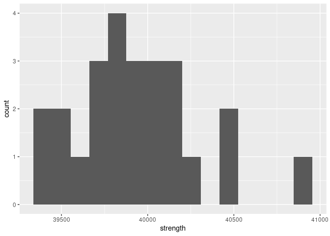

Structural Safety
================
Brooke Moss
2023-04-01

- <a href="#grading-rubric" id="toc-grading-rubric">Grading Rubric</a>
  - <a href="#individual" id="toc-individual">Individual</a>
  - <a href="#due-date" id="toc-due-date">Due Date</a>
- <a href="#setup" id="toc-setup">Setup</a>
  - <a
    href="#q1-visualize-the-strength-data-with-a-histogram-answer-the-questions-below"
    id="toc-q1-visualize-the-strength-data-with-a-histogram-answer-the-questions-below"><strong>q1</strong>
    Visualize the strength data with a histogram. Answer the questions
    below.</a>
- <a href="#assessing-structural-safety"
  id="toc-assessing-structural-safety">Assessing Structural Safety</a>
  - <a href="#structural-model" id="toc-structural-model">Structural
    model</a>
    - <a
      href="#q2-using-the-observations-in-df_samples-and-the-structural-model-g_break-estimate-the-probability-of-failure"
      id="toc-q2-using-the-observations-in-df_samples-and-the-structural-model-g_break-estimate-the-probability-of-failure"><strong>q2</strong>
      Using the observations in <code>df_samples</code> and the structural
      model <code>g_break()</code>, estimate the probability of failure.</a>
  - <a href="#material-property-model"
    id="toc-material-property-model">Material property model</a>
    - <a
      href="#q3-fit-a-lognormal-distribution-to-the-strength-data-using-the-fitdistr-function"
      id="toc-q3-fit-a-lognormal-distribution-to-the-strength-data-using-the-fitdistr-function"><strong>q3</strong>
      Fit a lognormal distribution to the strength data using the
      <code>fitdistr()</code> function.</a>
    - <a
      href="#q4-complete-the-code-below-by-1-choosing-a-monte-carlo-sample-size-n_monte_carlo-2-extracting-the-estimated-parameters-from-q3-and-3-computing-the-limit-state-value-g--g_break-answer-the-questions-under-observations-below"
      id="toc-q4-complete-the-code-below-by-1-choosing-a-monte-carlo-sample-size-n_monte_carlo-2-extracting-the-estimated-parameters-from-q3-and-3-computing-the-limit-state-value-g--g_break-answer-the-questions-under-observations-below"><strong>q4</strong>
      Complete the code below by 1. choosing a Monte Carlo sample size
      <code>n_monte_carlo</code>, 2. extracting the estimated parameters from
      q3, and 3. computing the limit state value <code>g = g_break()</code>.
      Answer the questions under <em>observations</em> below.</a>
  - <a href="#a-different-way-to-compute-the-pof"
    id="toc-a-different-way-to-compute-the-pof">A different way to compute
    the POF</a>
    - <a
      href="#q5-finish-the-following-function-by-computing-the-pof-with-plnorm-answer-the-questions-under-observations-below"
      id="toc-q5-finish-the-following-function-by-computing-the-pof-with-plnorm-answer-the-questions-under-observations-below"><strong>q5</strong>
      Finish the following function by computing the POF with
      <code>plnorm()</code>. Answer the questions under <em>observations</em>
      below.</a>
  - <a href="#quantifying-sampling-uncertainty"
    id="toc-quantifying-sampling-uncertainty">Quantifying sampling
    uncertainty</a>
    - <a
      href="#q6-the-code-below-estimates-a-bootstrap-ci-on-your-pof-estimate-answer-the-questions-under-observations-below"
      id="toc-q6-the-code-below-estimates-a-bootstrap-ci-on-your-pof-estimate-answer-the-questions-under-observations-below"><strong>q6</strong>
      The code below estimates a bootstrap CI on your POF estimate. Answer the
      questions under <em>observations</em> below.</a>

*Purpose*: Most real problems have multiple sources of uncertainty mixed
together. Untangling these different sources can be challenging, even on
a conceptual level. In this challenge we’ll study a simple problem of
structural safety, and use this small case study to untangle sources of
sampling and Monte Carlo uncertainty.

*Note*: In this challenge I provide a lot of stub-code; you won’t have
to do too much coding. This is because I want you to *focus on answering
the conceptual questions*. The most important questions in this
challenge are: *What sources of uncertainty are you accounting for? What
sources are you not accounting for? Are those sources real or induced?*

<!-- include-rubric -->

# Grading Rubric

<!-- -------------------------------------------------- -->

Unlike exercises, **challenges will be graded**. The following rubrics
define how you will be graded, both on an individual and team basis.

## Individual

<!-- ------------------------- -->

| Category    | Needs Improvement                                                                                                | Satisfactory                                                                                                               |
|-------------|------------------------------------------------------------------------------------------------------------------|----------------------------------------------------------------------------------------------------------------------------|
| Effort      | Some task **q**’s left unattempted                                                                               | All task **q**’s attempted                                                                                                 |
| Observed    | Did not document observations, or observations incorrect                                                         | Documented correct observations based on analysis                                                                          |
| Supported   | Some observations not clearly supported by analysis                                                              | All observations clearly supported by analysis (table, graph, etc.)                                                        |
| Assessed    | Observations include claims not supported by the data, or reflect a level of certainty not warranted by the data | Observations are appropriately qualified by the quality & relevance of the data and (in)conclusiveness of the support      |
| Specified   | Uses the phrase “more data are necessary” without clarification                                                  | Any statement that “more data are necessary” specifies which *specific* data are needed to answer what *specific* question |
| Code Styled | Violations of the [style guide](https://style.tidyverse.org/) hinder readability                                 | Code sufficiently close to the [style guide](https://style.tidyverse.org/)                                                 |

## Due Date

<!-- ------------------------- -->

All the deliverables stated in the rubrics above are due **at midnight**
before the day of the class discussion of the challenge. See the
[Syllabus](https://docs.google.com/document/d/1qeP6DUS8Djq_A0HMllMqsSqX3a9dbcx1/edit?usp=sharing&ouid=110386251748498665069&rtpof=true&sd=true)
for more information.

# Setup

<!-- ----------------------------------------------------------------------- -->

``` r
library(MASS)
library(rsample)
library(broom)
library(tidyverse)
```

    ## ── Attaching packages ─────────────────────────────────────── tidyverse 1.3.2 ──
    ## ✔ ggplot2 3.4.0      ✔ purrr   1.0.1 
    ## ✔ tibble  3.2.0      ✔ dplyr   1.0.10
    ## ✔ tidyr   1.2.1      ✔ stringr 1.5.0 
    ## ✔ readr   2.1.4      ✔ forcats 0.5.2 
    ## ── Conflicts ────────────────────────────────────────── tidyverse_conflicts() ──
    ## ✖ dplyr::filter() masks stats::filter()
    ## ✖ dplyr::lag()    masks stats::lag()
    ## ✖ dplyr::select() masks MASS::select()

``` r
filename_samples <- "./data/al_samples.csv"
```

*Background*: The
[strength](https://en.wikipedia.org/wiki/Ultimate_tensile_strength) of a
material is the amount of mechanical stress it can survive before
breaking. To illustrate: Stresses are internal forces that hold an
object together when we try to squeeze, stretch, or otherwise deform a
solid object. For instance, if we pull on a rectangular bar of material,
internal stresses $\sigma$ work to keep the bar together.


By Jorge Stolfi - Own work, CC BY-SA 3.0,
<https://commons.wikimedia.org/w/index.php?curid=24499456>

*Strength* is a measure of how much internal stress an object can
survive: A higher strength means a stronger material. This challenge’s
data are very simple: They are (synthetic) observations of ultimate
tensile strength (UTS) on individual samples of the same aluminum alloy.
The experiments were carried out following the highest standards of
experimental rigor, so you should consider these values to be the “true”
breaking strength for each sample.

``` r
## NOTE: No need to edit; load data
df_samples <- read_csv(filename_samples)
```

    ## Rows: 25 Columns: 1
    ## ── Column specification ────────────────────────────────────────────────────────
    ## Delimiter: ","
    ## dbl (1): strength
    ## 
    ## ℹ Use `spec()` to retrieve the full column specification for this data.
    ## ℹ Specify the column types or set `show_col_types = FALSE` to quiet this message.

``` r
df_samples
```

    ## # A tibble: 25 × 1
    ##    strength
    ##       <dbl>
    ##  1   39484.
    ##  2   39812.
    ##  3   40052.
    ##  4   40519.
    ##  5   40045.
    ##  6   40160.
    ##  7   40094.
    ##  8   39674.
    ##  9   40144.
    ## 10   39865.
    ## # … with 15 more rows

Data Dictionary:

| Quantity       | Units |
|----------------|-------|
| Strength (UTS) | psi   |

### **q1** Visualize the strength data with a histogram. Answer the questions below.

``` r
df_samples %>%
  ggplot() +
  geom_histogram(aes(strength), bins = 15)
```

<!-- -->

**Observations**:

- What is the mean strength of the material, approximately?
  - The mean strength of the material appears to be around 40,000 psi.
- To what extent can you tell what shape the distribution of the data
  has?
  - I reduced the number of bins with the hope of seeing more of a
    shape, rather than a bunch of single-point bins. The shape seems to
    skew left, with a large grouping around \~39,900 psi.
- Assuming the scopus is the strength of an individual part made from
  this aluminum alloy, is the observed variability real or induced?
  - This variability is primarily real, given that the strength
    measurements are taken to be “true”. However, generally I would
    assume that since the tests were destructive, there is the potential
    for induced variability as well.

# Assessing Structural Safety

<!-- ----------------------------------------------------------------------- -->

*Objective*: In this challenge you are going to study a structure and
assess its *probability of failure* (POF). A higher POF corresponds to a
more unsafe structure. Ultimately, we want

$$\text{POF} < 0.03.$$

Your job is to assess a given structure using the data provided and
determine whether you can *confidently* conclude that `POF < 0.03`.

## Structural model

<!-- --------------------------------------- -->

The following code chunk sets up a structural model: We are considering
a rectangular bar under uniaxial tensile load (as pictured above). A
larger cross-sectional area `A` is capable of surviving a greater load
`L`, but a larger `A` is a heavier (more expensive) structure. The
internal stress is approximately `sigma = L / A`—we simply compare this
quantity against the strength.

I pick particular values for `A, L` and package all the information in
the *limit state function* `g_break`:

``` r
## NOTE: No need to edit; model setup
A <- 0.0255 # Cross-sectional area
L <- 1000 # Applied load (lbs)

g_break <- function(strength) {
  strength - L / A
}
```

The *probability of failure* (POF) is then defined in terms of the limit
state $g$ via:

$$\text{POF} \equiv \mathbb{P}[g \leq 0].$$

### **q2** Using the observations in `df_samples` and the structural model `g_break()`, estimate the probability of failure.

*Hint*: In `c07-monte-carlo` you learned how to estimate a probability
as the `mean()` of an indicator. Use the same strategy here.

``` r
## TODO: Estimate the probability of failure; i.e. POF = Pr[g <= 0]
df_samples <-
  df_samples %>%
  mutate(
    pof = 1 * (g_break(strength) <= 0)
  )

POF <-
  df_samples$pof %>%
  mean()

POF
```

    ## [1] 0

**Observations**:

- Does this estimate satisfy `POF < 0.03`?
  - Yes, this estimate does satisfy `POF < 0.03`.
- Is this estimate of the probability of failure trustworthy? Why or why
  not?
  - I think this estimate of the probability of failure is only somewhat
    trustworthy. It is worth nothing that none of the `g` values even
    came close to being less than 0, but with only 25 samples it is
    tough to know for sure.
- Can you confidently conclude that `POF < 0.03`? Why or why not?
  - I would not say I can confidently conclude that `POF < 0.03`, since
    I only have 25 samples to base my results on.

## Material property model

<!-- --------------------------------------- -->

Since we have so few physical samples, we will fit a distribution to
model the material property. This will give us the means to draw
“virtual samples” and use those to estimate the POF.

### **q3** Fit a lognormal distribution to the strength data using the `fitdistr()` function.

*Note*: In this challenge I generated the `strength` data from a
`lognormal` distribution; if you didn’t know that fact, then the choice
of distribution would be an *additional* source of uncertainty!

*Hint 1*: We learned how to do this in `e-stat08-fit-dist`.

*Hint 2*: The `fitdistr` function uses `densfun = "lognormal"` to
specify a lognormal distribution.

``` r
## TODO:
df_fit <-
  df_samples$strength %>%
  fitdistr(densfun = "lognormal")
df_fit
```

    ##      meanlog         sdlog    
    ##   10.595117912    0.008750493 
    ##  ( 0.001750099) ( 0.001237507)

Once you’ve successfully fit a model for the strength, you can estimate
the probability of failure by drawing samples from the fitted
distribution.

### **q4** Complete the code below by 1. choosing a Monte Carlo sample size `n_monte_carlo`, 2. extracting the estimated parameters from q3, and 3. computing the limit state value `g = g_break()`. Answer the questions under *observations* below.

*Hint 1*: You will need to combine ideas from `c07-monte-carlo` and
`e-stat08-fit-dist` in order to complete this task.

*Hint 2*: The function `rlnorm()` will allow you to draw samples from a
lognormal distribution.

``` r
## TODO 1: Choose Monte Carlo sample size
n_monte_carlo <- 1000

## TODO 2: Extract parameter estimates from df_fit
strength_meanlog <- 10.595117912
strength_sdlog <- 0.008750493

# Generate samples
df_norm_sim <-
  tibble(strength = rlnorm(n_monte_carlo, strength_meanlog, strength_sdlog)) %>%
## TODO 3: Compute structural response
  mutate(g = g_break(strength))

## NOTE: The following code estimates the POF and a 95% confidence interval
df_norm_pof <-
  df_norm_sim %>%
  mutate(stat = g <= 0) %>%
  summarize(
    pof_est = mean(stat),
    se = sd(stat) / sqrt(n_monte_carlo)
  ) %>%
  mutate(
    pof_lo = pof_est - 1.96 * se,
    pof_hi = pof_est + 1.96 * se
  ) %>%
  select(pof_lo, pof_est, pof_hi)

df_norm_pof
```

    ## # A tibble: 1 × 3
    ##   pof_lo pof_est pof_hi
    ##    <dbl>   <dbl>  <dbl>
    ## 1 0.0121   0.021 0.0299

- Assuming your scopus is the probability of failure `POF` defined
  above, does your estimate exhibit real variability, induced
  variability, or both?
  - Because the initial physical values were assumed to have only real
    variability, and we have now added Monte Carlo estimation (and
    therefore induced variability), both are present.
- Does this confidence interval imply that `POF < 0.03`?
  - Yes, my confidence interval implies that `POF < 0.03`, as even the
    upper end of the estimate is 0.0188.
- Compare this probability with your estimate from q2; is it more or
  less trustworthy?
  - This probability feels more trustworthy, because I used a sample
    size of 1000 instead of just 25.
- Does the confidence interval above account for uncertainty arising
  from the *Monte Carlo approximation*? Why or why not?
  - No, this confidence interval does not account for Monte Carlo
    uncertainty, since the random nature of this estimation strategy is
    bound to introduce additional uncertainty.
- Does the confidence interval above account for uncertainty arising
  from *limited physical tests* (`df_samples`)? Why or why not?
  - No, this does not account for uncertainty from limited physical
    tests, as the distribution to generate the Monte Carlo data is only
    based on the 25 physical tests.
- What could you do to tighten up the confidence interval?
  - To tighten the confidence interval, I could either increase the
    number of Monte Carlo samples to minimize the approximation
    uncertainty, or make some sort of change to the distribution that
    informs the Monte Carlo generation.
- Can you *confidently* conclude that `POF < 0.03`? Why or why not?
  - I think I could confidently conclude that `POF < 0.03` with a sample
    size this large, although there is a chance that a larger set of
    physical samples could disprove this.

## A different way to compute the POF

<!-- --------------------------------------- -->

Monte Carlo is a *general* way to estimate probabilities, but it
introduces approximation error. It turns out that, for the simple
problem we’re studying, we can compute the probability directly using
the CDF. Note that for our structural safety problem, we have

$$\text{POF} = \mathbb{P}[g \leq 0] = \mathbb{P}[S \leq L / A] = \text{CDF}_S(L/A).$$

Since
`S = rlnorm(n, meanlog = strength_meanlog, sdlog = strength_sdlog)`, we
can use `plnorm` to compute the probability of failure without Monte
Carlo as
`POF = plnorm(L/A, meanlog = strength_meanlog, sdlog = strength_sdlog)`.
Let’s combine this idea with the fitted distribution to estimate the
POF.

### **q5** Finish the following function by computing the POF with `plnorm()`. Answer the questions under *observations* below.

``` r
## TODO: Complete the function below;
##       note that you only need to edit the TODO section

estimate_pof <- function(df) {
  ## Fit the distribution
  df_fit <-
    df %>%
    pull(strength) %>%
    fitdistr(densfun = "lognormal") %>%
    tidy()

  ## Extract the parameters
  strength_meanlog <-
    df_fit %>%
    filter(term == "meanlog") %>%
    pull(estimate)
  strength_sdlog <-
    df_fit %>%
    filter(term == "sdlog") %>%
    pull(estimate)

## TODO: Estimate the probability of failure using plnorm
  pof_estimate <-
    plnorm(L/A, strength_meanlog, strength_sdlog)

  ## NOTE: No need to edit; this last line returns your pof_estimate
  pof_estimate
}

## NOTE: No need to edit; test your function
df_samples %>% estimate_pof()
```

    ## [1] 0.01832289

**Observations**:

- How does this estimate compare with your Monte Carlo estimate above?
  - This estimate is extraordinarily close to the “high” end of my Monte
    Carlo estimate.
- Does this estimate have any uncertainty due to *Monte Carlo
  approximation*? Why or why not?
  - No, this estimate has eliminated the Monte Carlo-based uncertainty.
    This is because `POF` is now a function of `L/A` directly (using
    `plnorm` instead of `rlnorm`), so Monte Carlo approximation is not
    used in this estimate.
- With the scopus as the `POF`, would uncertainty due to *Monte Carlo
  approximation* be induced or real?
  - With the scopus as the `POF`, uncertainty due to Monte Carlo would
    be induced.
- Does this estimate have any uncertainty due to *limited physical
  tests*? Why or why not?
  - Yes, this estimate still has uncertainty due to limited physical
    testing because the distribution for the Monte Carlo generation is
    still based on the 25 physical samples.
- With the scopus as the `POF`, would uncertainty due to *limited
  physical tests* be induced or real?
  - With the scopus as the `POF`, uncertainty due to limited physical
    tests would be a combination of real and induced, although the
    assumption that the physical values are “true” means this would just
    be real uncertainty.

## Quantifying sampling uncertainty

<!-- --------------------------------------- -->

Using `plnorm()` gets rid of Monte Carlo error, but we still have
uncertainty due to limited physical testing. Often we can use a CLT
approximation to construct a confidence interval. However, with
`plnorm()` we can’t use a CLT approximation because it does not follow
the assumptions of the central limit theorem (it’s not a sum of iid
random variables). Instead, we can use the *bootstrap* to approximate a
confidence interval via re-sampling.

### **q6** The code below estimates a bootstrap CI on your POF estimate. Answer the questions under *observations* below.

``` r
## NOTE: No need to edit; run and inspect
tidycustom <- function(est) {tibble(term = "pof", estimate = est)}

df_samples %>%
  bootstraps(times = 1000) %>%
  mutate(
    estimates = map(
      splits,
      ~ analysis(.x) %>% estimate_pof() %>% tidycustom()
    )
  ) %>%
  int_pctl(estimates)
```

    ## # A tibble: 1 × 6
    ##   term   .lower .estimate .upper .alpha .method   
    ##   <chr>   <dbl>     <dbl>  <dbl>  <dbl> <chr>     
    ## 1 pof   0.00123    0.0178 0.0481   0.05 percentile

**Observations**:

- Does the confidence interval above account for uncertainty arising
  from *Monte Carlo approximation* of the POF? Why or why not?
  - I don’t believe this estimation style includes Monte Carlo in its
    usual form, although the bootstrap method does introduce uncertainty
    from its randomness.
- Does the confidence interval above account for uncertainty arising
  from *limited physical tests* (`df_samples`)? Why or why not?
  - The bootstrap method does account for uncertainty from limited
    physical tests because it re-samples the small number of samples and
    helps counteract the lack of physical tests.
- Can you confidently conclude that `POF < 0.03`? Why or why not?
  - No, I cannot confidently conclude that `POF < 0.03`, since although
    the estimate is within that range, the upper bound of this result is
    0.049, which is greater than 0.03.
