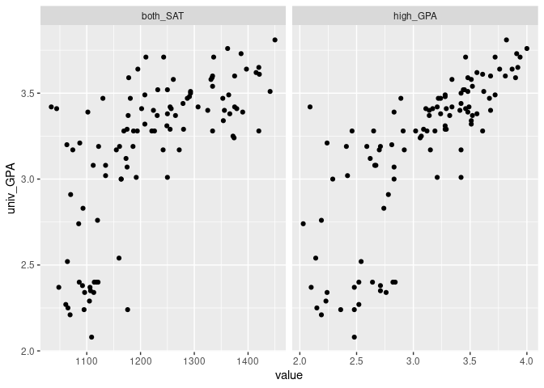
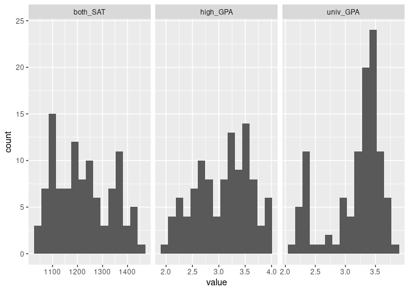

SAT and College Grades
================
Brooke Moss
2023-04-19

- <a href="#grading-rubric" id="toc-grading-rubric">Grading Rubric</a>
  - <a href="#individual" id="toc-individual">Individual</a>
  - <a href="#due-date" id="toc-due-date">Due Date</a>
- <a href="#obtain-the-data" id="toc-obtain-the-data">Obtain the Data</a>
  - <a
    href="#q1-visit-the-sat-and-college-gpa-case-study-page-scroll-to-the-bottom-and-click-the-open-data-with-excel-button-this-will-allow-you-to-download-an-xls-file-save-the-file-to-your-data-folder-load-the-data-as-df_sat-and-perform-your-first-checks-against-these-data-answer-the-questions-below"
    id="toc-q1-visit-the-sat-and-college-gpa-case-study-page-scroll-to-the-bottom-and-click-the-open-data-with-excel-button-this-will-allow-you-to-download-an-xls-file-save-the-file-to-your-data-folder-load-the-data-as-df_sat-and-perform-your-first-checks-against-these-data-answer-the-questions-below"><strong>q1</strong>
    Visit the SAT and College GPA case study page, scroll to the bottom, and
    click the <code>Open Data with Excel</code> button. This will allow you
    to download an <code>xls</code> file. Save the file to your
    <code>data</code> folder, load the data as <code>df_sat</code>, and
    perform your “first checks” against these data. Answer the questions
    below:</a>
- <a href="#analysis-with-hypothesis-testing"
  id="toc-analysis-with-hypothesis-testing">Analysis with Hypothesis
  Testing</a>
  - <a href="#view-1-correlations" id="toc-view-1-correlations">View 1:
    Correlations</a>
    - <a
      href="#q2-create-a-single-plot-that-shows-univ_gpa-against-both-high_gpa-and-both_sat-visually-compare-the-two-trends"
      id="toc-q2-create-a-single-plot-that-shows-univ_gpa-against-both-high_gpa-and-both_sat-visually-compare-the-two-trends"><strong>q2</strong>
      Create a <em>single</em> plot that shows <code>univ_GPA</code> against
      <em>both</em> <code>high_GPA</code> and <code>both_SAT</code>. Visually
      compare the two trends.</a>
    - <a href="#hypothesis-testing-with-a-correlation-coefficient"
      id="toc-hypothesis-testing-with-a-correlation-coefficient">Hypothesis
      Testing with a Correlation Coefficient</a>
    - <a
      href="#q3-plot-histograms-for-both_sat-high_gpa-univ_gpa-whichif-anyof-the-variables-look-approximately-normally-distributed"
      id="toc-q3-plot-histograms-for-both_sat-high_gpa-univ_gpa-whichif-anyof-the-variables-look-approximately-normally-distributed"><strong>q3</strong>
      Plot histograms for <code>both_SAT, high_GPA, univ_GPA</code>. Which—if
      any—of the variables look approximately normally distributed.</a>
    - <a
      href="#q4-use-the-function-cortest-to-construct-confidence-intervals-for-corrhigh_gpa-univ_gpa-and-corrboth_sat-univ_gpa-answer-the-questions-below"
      id="toc-q4-use-the-function-cortest-to-construct-confidence-intervals-for-corrhigh_gpa-univ_gpa-and-corrboth_sat-univ_gpa-answer-the-questions-below"><strong>q4</strong>
      Use the function <code>cor.test()</code> to construct confidence
      intervals for <code>corr[high_GPA, univ_GPA]</code> and
      <code>corr[both_SAT, univ_GPA]</code>. Answer the questions below.</a>
    - <a
      href="#q5-use-the-bootstrap-to-approximate-a-confidence-interval-for-corrhigh_gpa-univ_gpa-compare-your-resultsboth-the-estimate-and-confidence-intervalto-your-results-from-q4"
      id="toc-q5-use-the-bootstrap-to-approximate-a-confidence-interval-for-corrhigh_gpa-univ_gpa-compare-your-resultsboth-the-estimate-and-confidence-intervalto-your-results-from-q4"><strong>q5</strong>
      Use the bootstrap to approximate a confidence interval for
      <code>corr[high_GPA, univ_GPA]</code>. Compare your results—both the
      estimate and confidence interval—to your results from q4.</a>
  - <a href="#view-2-modeling" id="toc-view-2-modeling">View 2: Modeling</a>
    - <a href="#hypothesis-testing-with-a-model"
      id="toc-hypothesis-testing-with-a-model">Hypothesis Testing with a
      Model</a>
    - <a
      href="#q6-fit-a-linear-model-predicting-univ_gpa-with-the-predictor-both_sat-assess-the-model-to-determine-how-effective-a-predictor-both_sat-is-for-univ_gpa-interpret-the-resulting-confidence-interval-for-the-coefficient-on-both_sat"
      id="toc-q6-fit-a-linear-model-predicting-univ_gpa-with-the-predictor-both_sat-assess-the-model-to-determine-how-effective-a-predictor-both_sat-is-for-univ_gpa-interpret-the-resulting-confidence-interval-for-the-coefficient-on-both_sat"><strong>q6</strong>
      Fit a linear model predicting <code>univ_GPA</code> with the predictor
      <code>both_SAT</code>. Assess the model to determine how effective a
      predictor <code>both_SAT</code> is for <code>univ_GPA</code>. Interpret
      the resulting confidence interval for the coefficient on
      <code>both_SAT</code>.</a>
    - <a
      href="#q7-fit-a-model-predicting-univ_gpa-using-both-high_gpa-and-both_sat-compare-the-prediction-accuracy-and-hypothesis-test-results"
      id="toc-q7-fit-a-model-predicting-univ_gpa-using-both-high_gpa-and-both_sat-compare-the-prediction-accuracy-and-hypothesis-test-results"><strong>q7</strong>
      Fit a model predicting <code>univ_GPA</code> using both
      <code>high_GPA</code> and <code>both_SAT</code>. Compare the prediction
      accuracy and hypothesis test results.</a>
  - <a href="#synthesize" id="toc-synthesize">Synthesize</a>
    - <a
      href="#q8-using-the-results-from-all-previous-qs-answer-the-following-questions"
      id="toc-q8-using-the-results-from-all-previous-qs-answer-the-following-questions"><strong>q8</strong>
      Using the results from all previous q’s, answer the following
      questions.</a>
- <a href="#end-notes" id="toc-end-notes">End Notes</a>

*Purpose*: How do we apply hypothesis testing to investigating data? In
this challenge you’ll practice using hypothesis testing tools to make
sense of a dataset.

*Reading*: - [Harvard Study Says SATs Should Be Optional: Here’s
Why](https://www.csmonitor.com/USA/USA-Update/2016/0120/Harvard-study-says-SATs-should-be-optional.-Here-s-why)
(Optional); easy-to-read news article on colleges going SAT-free -
[Norm-Referenced Tests and Race-Blind
Admissions](https://cshe.berkeley.edu/publications/norm-referenced-tests-and-race-blind-admissions-case-eliminating-sat-and-act-university)
(Optional); technical report on relationship between the SAT/ACT and
non-academic factors

*Credit*: This is based on a [case
study](http://onlinestatbook.com/2/case_studies/sat.html) originally
prepared by Emily Zitek, with data collected through the research of
Thomas MacFarland.

``` r
library(tidyverse)
```

    ## ── Attaching packages ─────────────────────────────────────── tidyverse 1.3.2 ──
    ## ✔ ggplot2 3.4.0      ✔ purrr   1.0.1 
    ## ✔ tibble  3.2.0      ✔ dplyr   1.0.10
    ## ✔ tidyr   1.2.1      ✔ stringr 1.5.0 
    ## ✔ readr   2.1.4      ✔ forcats 0.5.2 
    ## ── Conflicts ────────────────────────────────────────── tidyverse_conflicts() ──
    ## ✖ dplyr::filter() masks stats::filter()
    ## ✖ dplyr::lag()    masks stats::lag()

``` r
library(readxl)
library(broom)
library(modelr)
```

    ## 
    ## Attaching package: 'modelr'
    ## 
    ## The following object is masked from 'package:broom':
    ## 
    ##     bootstrap

``` r
library(rsample)
library(correlation)
```

<!-- include-rubric -->

# Grading Rubric

<!-- -------------------------------------------------- -->

Unlike exercises, **challenges will be graded**. The following rubrics
define how you will be graded, both on an individual and team basis.

## Individual

<!-- ------------------------- -->

| Category    | Needs Improvement                                                                                                | Satisfactory                                                                                                               |
|-------------|------------------------------------------------------------------------------------------------------------------|----------------------------------------------------------------------------------------------------------------------------|
| Effort      | Some task **q**’s left unattempted                                                                               | All task **q**’s attempted                                                                                                 |
| Observed    | Did not document observations, or observations incorrect                                                         | Documented correct observations based on analysis                                                                          |
| Supported   | Some observations not clearly supported by analysis                                                              | All observations clearly supported by analysis (table, graph, etc.)                                                        |
| Assessed    | Observations include claims not supported by the data, or reflect a level of certainty not warranted by the data | Observations are appropriately qualified by the quality & relevance of the data and (in)conclusiveness of the support      |
| Specified   | Uses the phrase “more data are necessary” without clarification                                                  | Any statement that “more data are necessary” specifies which *specific* data are needed to answer what *specific* question |
| Code Styled | Violations of the [style guide](https://style.tidyverse.org/) hinder readability                                 | Code sufficiently close to the [style guide](https://style.tidyverse.org/)                                                 |

## Due Date

<!-- ------------------------- -->

All the deliverables stated in the rubrics above are due **at midnight**
before the day of the class discussion of the challenge. See the
[Syllabus](https://docs.google.com/document/d/1qeP6DUS8Djq_A0HMllMqsSqX3a9dbcx1/edit?usp=sharing&ouid=110386251748498665069&rtpof=true&sd=true)
for more information.

*Background*: Every year about 2 million students take the Scholastic
Aptitude Test (SAT). The exam is
[controversial](http://www.nea.org/home/73288.htm) but [extremely
consequential](https://www.csmonitor.com/2004/0518/p13s01-legn.html).
There are many claims about the SAT, but we’re going to look at just
one: Is the SAT predictive of scholastic performance in college? It
turns out this is a fairly complicated question to assess—we’ll get an
introduction to some of the complexities.

# Obtain the Data

<!-- -------------------------------------------------- -->

### **q1** Visit the [SAT and College GPA](http://onlinestatbook.com/2/case_studies/sat.html) case study page, scroll to the bottom, and click the `Open Data with Excel` button. This will allow you to download an `xls` file. Save the file to your `data` folder, load the data as `df_sat`, and perform your “first checks” against these data. Answer the questions below:

``` r
## TODO:
df_sat <-
  read_xls(
    path = "./data/sat.xls"
  )

## TODO: Do your "first checks"
glimpse(df_sat)
```

    ## Rows: 105
    ## Columns: 5
    ## $ high_GPA <dbl> 3.45, 2.78, 2.52, 3.67, 3.24, 2.10, 2.82, 2.36, 2.42, 3.51, 3…
    ## $ math_SAT <dbl> 643, 558, 583, 685, 592, 562, 573, 559, 552, 617, 684, 568, 6…
    ## $ verb_SAT <dbl> 589, 512, 503, 602, 538, 486, 548, 536, 583, 591, 649, 592, 5…
    ## $ comp_GPA <dbl> 3.76, 2.87, 2.54, 3.83, 3.29, 2.64, 2.86, 2.03, 2.81, 3.41, 3…
    ## $ univ_GPA <dbl> 3.52, 2.91, 2.40, 3.47, 3.47, 2.37, 2.40, 2.24, 3.02, 3.32, 3…

``` r
summary(df_sat)
```

    ##     high_GPA        math_SAT        verb_SAT        comp_GPA    
    ##  Min.   :2.030   Min.   :516.0   Min.   :480.0   Min.   :2.030  
    ##  1st Qu.:2.670   1st Qu.:573.0   1st Qu.:548.0   1st Qu.:2.870  
    ##  Median :3.170   Median :612.0   Median :591.0   Median :3.210  
    ##  Mean   :3.076   Mean   :623.1   Mean   :598.6   Mean   :3.128  
    ##  3rd Qu.:3.480   3rd Qu.:675.0   3rd Qu.:645.0   3rd Qu.:3.490  
    ##  Max.   :4.000   Max.   :718.0   Max.   :732.0   Max.   :4.000  
    ##     univ_GPA    
    ##  Min.   :2.080  
    ##  1st Qu.:3.010  
    ##  Median :3.290  
    ##  Mean   :3.173  
    ##  3rd Qu.:3.470  
    ##  Max.   :3.810

**Observations**:

- Fill in the following “data dictionary”

| Column     | Meaning                                |
|------------|----------------------------------------|
| `high_GPA` | High school grade point average        |
| `math_SAT` | Math SAT score                         |
| `verb_SAT` | Verbal SAT score                       |
| `comp_GPA` | Computer science grade point average   |
| `univ_GPA` | Overall university grade point average |

- What information do we have about these students?
  - High school GPA, university GPA, computer science GPA, and SAT
    scores.
  - All students were computer science students at a state university.
  - All students graduated with a BS in CS.
- What kinds of information *do we not have* about these students?
  - Gender
  - Race
  - High school course options
  - Family income
  - High school funding/opportunities
  - Hometown
- Based on these missing variables, what possible effects could be
  present in the data that we would have *no way of detecting*?
  - We have no way of detecting which students may have had additional
    resources to prepare for the SAT.
  - We don’t know which students may have come from school districts
    with limited access to advanced coursework.

# Analysis with Hypothesis Testing

<!-- ----------------------------------------------------------------------- -->

We’re going to use two complementary approaches to analyze the data, the
first based on hypothesis testing of correlation coefficients, and the
second based on fitting a regression model and interpreting the
regression coefficients.

To simplify the analysis, let’s look at a composite SAT score:

``` r
## NOTE: No need to edit this
df_composite <-
  df_sat %>%
  mutate(both_SAT = math_SAT + verb_SAT)
```

## View 1: Correlations

<!-- ----------------------------------------------------------------------- -->

### **q2** Create a *single* plot that shows `univ_GPA` against *both* `high_GPA` and `both_SAT`. Visually compare the two trends.

*Hint*: One way to do this is to first *pivot* `df_composite`.

``` r
## TODO:
df_composite %>%
  pivot_longer(
    cols = c(high_GPA, both_SAT),
    names_to = "type",
    values_to = "value"
  ) %>%
  ggplot(aes(x = value, y = univ_GPA)) +
  geom_point() +
  facet_grid(cols = vars(type), scales = "free")
```

<!-- -->

**Observations**:

- What relationship do `univ_GPA` and `both_SAT` exhibit?
  - `univ_GPA` and `both_SAT` exhibit a somewhat shallow linear
    relationship, with an outlier group with low of both types of
    scores. This group is pretty far away from the trend in the rest of
    the data.
  - It seems that a high SAT predicts a high GPA, but a lower SAT
    doesn’t necessarily predict much about GPA.
- What relationship do `univ_GPA` and `high_GPA` exhibit?
  - `univ_GPA` and `high_GPA` exhibit a much more linear relationship.
    Although there are some low-`high_GPA`, high-`univ_GPA` points, for
    the most part the `high_GPA` seems to predict the `univ_GPA`.

### Hypothesis Testing with a Correlation Coefficient

<!-- ------------------------- -->

We can use the idea of hypothesis testing with a correlation
coefficient. The idea is to set our null hypothesis to the case where
there is no correlation, and test to see if the data contradict that
perspective. Formally, the null (H0) and alternative (HA) hypotheses
relating to a correlation coefficient between two variables `X, Y` are:

$$\text{H0: } \text{Corr}[X, Y] = 0$$

$$\text{HA: } \text{Corr}[X, Y] \neq 0$$

The R function `cor.test` implements such a hypothesis test under the
assumption that `X, Y` are both normally distributed. First, let’s check
to see if this assumption looks reasonable for our data.

### **q3** Plot histograms for `both_SAT, high_GPA, univ_GPA`. Which—if any—of the variables look approximately normally distributed.

``` r
df_composite %>%
  pivot_longer(
    cols = c(high_GPA, both_SAT, univ_GPA),
    names_to = "type",
    values_to = "value"
  ) %>%
  ggplot() +
  geom_histogram(aes(x = value), bins = 15) +
  facet_grid(cols = vars(type), scales = "free")
```

<!-- -->

**Observations**:

- To what extent does `both_SAT` look like a normal distribution?
  - `both_SAT` doesn’t look very normal, although it looks close to
    being a skewed-right distribution.
- To what extent does `high_GPA` look like a normal distribution?
  - `high_GPA` looks to be the closest to a normal distribution,
    partially skewed-left.
- To what extent does `univ_GPA` look like a normal distribution?
  - `univ_GPA` looks like a normal distribution except for the
    additional spike between 2.0 and 2.5.

Keep in mind your findings as you complete q4.

### **q4** Use the function `cor.test()` to construct confidence intervals for `corr[high_GPA, univ_GPA]` and `corr[both_SAT, univ_GPA]`. Answer the questions below.

``` r
## TODO: Use the function cor.test() to test the correlations between
##       high_GPA and univ_GPA, as well as between
##       both_SAT and univ_GPA
corr_GPA <-
  cor.test(
    x = df_composite$high_GPA,
    y = df_composite$univ_GPA
  )

corr_SAT <-
  cor.test(
    x = df_composite$both_SAT,
    y = df_composite$univ_GPA
  )

c(corr_GPA$estimate, corr_SAT$estimate)
```

    ##       cor       cor 
    ## 0.7795631 0.6846776

``` r
c(corr_GPA$conf.int, corr_SAT$conf.int)
```

    ## [1] 0.6911690 0.8449761 0.5674824 0.7746821

**Observations**:

- Which correlations are significantly nonzero?
  - Both correlation values are significantly nonzero.
- Which of `high_GPA` and `both_SAT` seems to be more strongly
  correlated with `univ_GPA`?
  - `high_GPA` appears to be more strongly correlated with `univ_GPA`,
    as its correlation value of 0.7795631 is greater than 0.6846776.
- How do the results here compare with the visual you created in q2?
  - These results appear to be consistent with my visual from q2, as
    `high_GPA` again has a higher correlation (presenting as a more
    linear relationship in q2).
- Based on these results, what can we say about the predictive
  capabilities of both `high_GPA` and `both_SAT` to predict `univ_GPA`?
  - From these results, we can say that `high_GPA` is a somewhat better
    predictor of `univ_GPA` than `both_SAT` is.

Finally, let’s use the bootstrap to perform the same test using
*different* assumptions.

### **q5** Use the bootstrap to approximate a confidence interval for `corr[high_GPA, univ_GPA]`. Compare your results—both the estimate and confidence interval—to your results from q4.

``` r
## TODO: Use the bootstrap to compute a confidence interval for corr[high_GPA, univ_GPA]
# df_comp_resample <-
 
# set.seed(101) 
# boots <-
#   df_composite %>%
#   bootstraps(times = 1000)
# 
# fit_nls_on_bootstrap <- function(split) {
#     # nls(df_composite ~ cor.test(high_GPA, univ_GPA), analysis(split))
#   
# }
# 
# boot_models <-
#   boots %>% 
#   mutate(model = map(splits, fit_nls_on_bootstrap),
#          coef_info = map(model, tidy))
# 
# boot_coefs <- 
#   boot_models %>% 
#   unnest(coef_info)

# function_1 <- function(data, i){
#   # d2 <- data[i]
#   cor_ans <- cor.test(data$high_GPA, data$univ_GPA)
#   # print(cor_ans)
#   return(cor_ans)
# }
# 
# bootstrap_correlation <- boot(df_composite, function_1, R = 9)
# 
# bootstrap_correlation

# df_comp_resample <-
#   bootstraps(df_composite, times = 1000) %>%
#   mutate(df = map(splits, ~ analysis(.x)))

# df_q5 <-
#   df_comp_resample %>%
#   mutate(
#     mean_est = map_dbl(
#       df,
#       ~ cor.test(high_GPA, univ_GPA)
#     )
#   )
# 
# df_q5
  

df_q5 <-
  map_dfr(
    seq(1, 100), # Number of replicates
    function(repl) {
      df_composite %>% 
        bootstraps(times = 100) %>%
        mutate(
          estimates = map(
            splits,
            # ~ analysis(.x) %>% pull(univ_GPA) %>% fitdistr(densfun = "normal") %>% tidy()
            ~ analysis(.x) %>% cor_test("high_GPA", "univ_GPA")
          )
        ) %>% 
        mutate(repl = repl)
    }
  )

# int_pctl(df_q5, estimates)
```

**Observations**:

- How does your estimate from q5 compare with your estimate from q4?
  - I have tried quite a few ways of getting this to work, and still
    have been unable. I plan on talking to Zach tomorrow and making
    corrections.
- How does your CI from q5 compare with your CI from q4?
  - (Your response here)

*Aside*: When you use two different approximations to compute the same
quantity and get similar results, that’s an *encouraging sign*. Such an
outcome lends a bit more credibility to the results.

## View 2: Modeling

<!-- ------------------------- -->

Correlations are useful for relating two variables at a time. To study
the relationship among more variables we can instead use a fitted model.
Using a model, we can also help assess whether it is *worthwhile* to
measure a variable.

To begin, let’s first split the data into training and validation sets.

``` r
## NOTE: No need to edit
set.seed(101)

df_train <-
  df_composite %>%
  rowid_to_column() %>%
  slice_sample(n = 80)

df_validate <-
  df_composite %>%
  rowid_to_column() %>%
  anti_join(
    .,
    df_train,
    by = "rowid"
  )
```

### Hypothesis Testing with a Model

<!-- ------------------------- -->

We can combine the ideas of hypothesis testing with a model. Using a
model, we can express our hypotheses in terms of the model parameters.
For instance, if we were interested in whether $X$ has an affect on $Y$,
we might set up a model:

$$Y_i = \beta X_i + \epsilon_i$$

With the hypotheses:

$$\text{H0}: \beta = 0$$

$$\text{HA}: \beta \neq 0$$

In this case, we’re testing for whether $X$ has a significant effect on
$Y$. Let’s apply this idea to relating the variables `univ_GPA` and
`high_GPA`. Luckily R has built-in tools to construct a confidence
interval on the $\beta$’s in a regression \[1\]; we’ll simply use those
tools rather than do it by hand.

### **q6** Fit a linear model predicting `univ_GPA` with the predictor `both_SAT`. Assess the model to determine how effective a predictor `both_SAT` is for `univ_GPA`. Interpret the resulting confidence interval for the coefficient on `both_SAT`.

``` r
## TODO: Fit a model of univ_GPA on the predictor both_SAT
fit_basic <-
  df_composite %>% 
  lm(
    data = .,
    formula = univ_GPA ~ both_SAT
  )

## NOTE: The following computes confidence intervals on regression coefficients
fit_basic %>%
  tidy(
    conf.int = TRUE,
    conf.level = 0.99
  )
```

    ## # A tibble: 2 × 7
    ##   term        estimate std.error statistic  p.value conf.low conf.high
    ##   <chr>          <dbl>     <dbl>     <dbl>    <dbl>    <dbl>     <dbl>
    ## 1 (Intercept) -0.172    0.352       -0.487 6.27e- 1 -1.10      0.753  
    ## 2 both_SAT     0.00274  0.000287     9.53  8.05e-16  0.00198   0.00349

**Observations**:

- What is the confidence interval on the coefficient of `both_SAT`? Is
  this coefficient significantly different from zero?
  - The confidence interval is \[0.00198, 0.00349\], with an estimate of
    0.00274. This is extremely close to zero, but given the different
    orders of magnitude of the two values, this is still significant.
- By itself, how well does `both_SAT` predict `univ_GPA`?
  - `both_SAT` by itself seems to be an okay predictor of `univ_GPA`,
    but not phenomenal.

Remember from `e-model03-interp-warnings` that there are challenges with
interpreting regression coefficients! Let’s investigate that idea
further.

### **q7** Fit a model predicting `univ_GPA` using both `high_GPA` and `both_SAT`. Compare the prediction accuracy and hypothesis test results.

``` r
## TODO: Fit and assess models with predictors both_SAT + high_GPA, and high_GPA alone
fit_high <-
  df_composite %>% 
  lm(
    data = .,
    formula = univ_GPA ~ high_GPA
  )

fit_high %>%
  tidy(
    conf.int = TRUE,
    conf.level = 0.99
  )
```

    ## # A tibble: 2 × 7
    ##   term        estimate std.error statistic  p.value conf.low conf.high
    ##   <chr>          <dbl>     <dbl>     <dbl>    <dbl>    <dbl>     <dbl>
    ## 1 (Intercept)    1.10     0.167       6.58 1.98e- 9    0.660     1.53 
    ## 2 high_GPA       0.675    0.0534     12.6  1.18e-22    0.535     0.815

``` r
fit_both <-
  df_composite %>% 
  lm(
    data = .,
    formula = univ_GPA ~ both_SAT + high_GPA
  )

fit_both %>%
  tidy(
    conf.int = TRUE,
    conf.level = 0.99
  )
```

    ## # A tibble: 3 × 7
    ##   term        estimate std.error statistic       p.value  conf.low conf.high
    ##   <chr>          <dbl>     <dbl>     <dbl>         <dbl>     <dbl>     <dbl>
    ## 1 (Intercept) 0.540     0.318         1.70 0.0924        -0.294      1.37   
    ## 2 both_SAT    0.000792  0.000387      2.05 0.0432        -0.000224   0.00181
    ## 3 high_GPA    0.541     0.0837        6.47 0.00000000353  0.322      0.761

**Observations**:

- How well do these models perform, compared to the one you built in q6?
  - The model with just `high_GPA` seems to perform roughly the same as,
    if not slightly better than the `both_SAT` model, although the
    combined model seems to actually be not significantly different from
    zero.
- What is the confidence interval on the coefficient of `both_SAT` when
  including `high_GPA` as a predictor?? Is this coefficient
  significantly different from zero?
  - The confidence interval on the coefficient of `both_SAT` is
    \[-.000223, 0.00181\], which is not significantly different from
    zero.
- How do the hypothesis test results compare with the results in q6?
  - These results actually appear to show less correlation than q6,
    although I could be reading this wrong.

## Synthesize

<!-- ------------------------- -->

Before closing, let’s synthesize a bit from the analyses above.

### **q8** Using the results from all previous q’s, answer the following questions.

**Observations**:

- Between `both_SAT` and `high_GPA`, which single variable would you
  choose to predict `univ_GPA`? Why?
  - If I had to choose a single variable, I would likely choose
    `high_GPA`, because the plots and early analysis in this assignment
    seem to suggest it is more strongly correlated, especially the
    correlation calculations in q4.
- Is `both_SAT` an effective predictor of `univ_GPA`? What specific
  pieces of evidence do you have in favor of `both_SAT` being effective?
  What specific pieces of evidence do you have against?
  - According to q6 and q7, `both_SAT` appears to actually be an okay
    predictor of `univ_GPA`, though the earlier questions, especially
    the plots, seem to suggest otherwise.

# End Notes

<!-- ----------------------------------------------------------------------- -->

\[1\] There are also assumptions underlying this kind of testing, for
more information see this [Wiki
article](https://en.wikipedia.org/wiki/Linear_regression#Assumptions).
