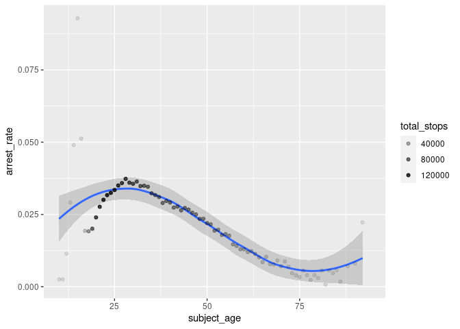
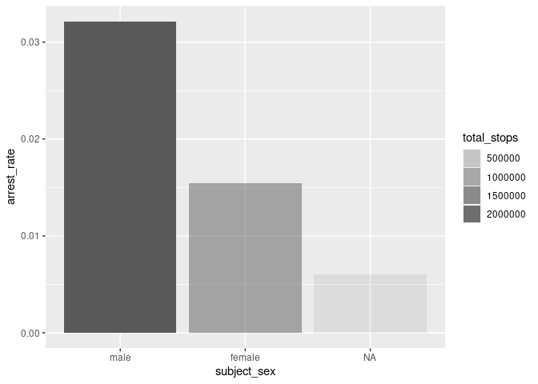
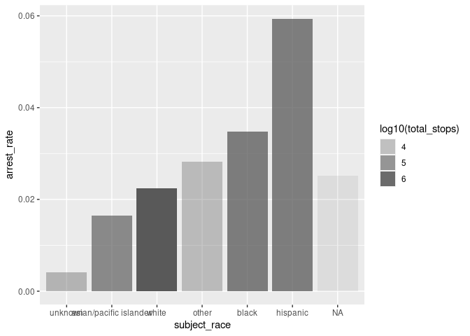

Massachusetts Highway Stops
================
Brooke Moss
2023-04-27

- <a href="#grading-rubric" id="toc-grading-rubric">Grading Rubric</a>
  - <a href="#individual" id="toc-individual">Individual</a>
  - <a href="#due-date" id="toc-due-date">Due Date</a>
- <a href="#setup" id="toc-setup">Setup</a>
  - <a
    href="#q1-go-to-the-stanford-open-policing-project-page-and-download-the-massachusetts-state-police-records-in-rds-format-move-the-data-to-your-data-folder-and-match-the-filename-to-load-the-data"
    id="toc-q1-go-to-the-stanford-open-policing-project-page-and-download-the-massachusetts-state-police-records-in-rds-format-move-the-data-to-your-data-folder-and-match-the-filename-to-load-the-data"><strong>q1</strong>
    Go to the Stanford Open Policing Project page and download the
    Massachusetts State Police records in <code>Rds</code> format. Move the
    data to your <code>data</code> folder and match the
    <code>filename</code> to load the data.</a>
- <a href="#eda" id="toc-eda">EDA</a>
  - <a
    href="#q2-do-your-first-checks-on-the-dataset-what-are-the-basic-facts-about-this-dataset"
    id="toc-q2-do-your-first-checks-on-the-dataset-what-are-the-basic-facts-about-this-dataset"><strong>q2</strong>
    Do your “first checks” on the dataset. What are the basic facts about
    this dataset?</a>
  - <a
    href="#q3-check-the-set-of-factor-levels-for-subject_race-and-raw_race-what-do-you-note-about-overlap--difference-between-the-two-sets"
    id="toc-q3-check-the-set-of-factor-levels-for-subject_race-and-raw_race-what-do-you-note-about-overlap--difference-between-the-two-sets"><strong>q3</strong>
    Check the set of factor levels for <code>subject_race</code> and
    <code>raw_Race</code>. What do you note about overlap / difference
    between the two sets?</a>
  - <a
    href="#q4-check-whether-subject_race-and-raw_race-match-for-a-large-fraction-of-cases-which-of-the-two-hypotheses-above-is-most-likely-based-on-your-results"
    id="toc-q4-check-whether-subject_race-and-raw_race-match-for-a-large-fraction-of-cases-which-of-the-two-hypotheses-above-is-most-likely-based-on-your-results"><strong>q4</strong>
    Check whether <code>subject_race</code> and <code>raw_Race</code> match
    for a large fraction of cases. Which of the two hypotheses above is most
    likely, based on your results?</a>
  - <a href="#vis" id="toc-vis">Vis</a>
    - <a
      href="#q5-compare-the-arrest-ratethe-fraction-of-total-cases-in-which-the-subject-was-arrestedacross-different-factors-create-as-many-visuals-or-tables-as-you-need-but-make-sure-to-check-the-trends-across-all-of-the-subject-variables-answer-the-questions-under-observations-below"
      id="toc-q5-compare-the-arrest-ratethe-fraction-of-total-cases-in-which-the-subject-was-arrestedacross-different-factors-create-as-many-visuals-or-tables-as-you-need-but-make-sure-to-check-the-trends-across-all-of-the-subject-variables-answer-the-questions-under-observations-below"><strong>q5</strong>
      Compare the <em>arrest rate</em>—the fraction of total cases in which
      the subject was arrested—across different factors. Create as many
      visuals (or tables) as you need, but make sure to check the trends
      across all of the <code>subject</code> variables. Answer the questions
      under <em>observations</em> below.</a>
- <a href="#modeling" id="toc-modeling">Modeling</a>
  - <a
    href="#q6-run-the-following-code-and-interpret-the-regression-coefficients-answer-the-the-questions-under-observations-below"
    id="toc-q6-run-the-following-code-and-interpret-the-regression-coefficients-answer-the-the-questions-under-observations-below"><strong>q6</strong>
    Run the following code and interpret the regression coefficients. Answer
    the the questions under <em>observations</em> below.</a>
  - <a
    href="#q7-re-fit-the-logistic-regression-from-q6-setting-white-as-the-reference-level-for-subject_race-interpret-the-the-model-terms-and-answer-the-questions-below"
    id="toc-q7-re-fit-the-logistic-regression-from-q6-setting-white-as-the-reference-level-for-subject_race-interpret-the-the-model-terms-and-answer-the-questions-below"><strong>q7</strong>
    Re-fit the logistic regression from q6 setting <code>"white"</code> as
    the reference level for <code>subject_race</code>. Interpret the the
    model terms and answer the questions below.</a>
  - <a
    href="#q8-re-fit-the-model-using-a-factor-indicating-the-presence-of-contraband-in-the-subjects-vehicle-answer-the-questions-under-observations-below"
    id="toc-q8-re-fit-the-model-using-a-factor-indicating-the-presence-of-contraband-in-the-subjects-vehicle-answer-the-questions-under-observations-below"><strong>q8</strong>
    Re-fit the model using a factor indicating the presence of contraband in
    the subject’s vehicle. Answer the questions under <em>observations</em>
    below.</a>
  - <a
    href="#q9-go-deeper-pose-at-least-one-more-question-about-the-data-and-fit-at-least-one-more-model-in-support-of-answering-that-question"
    id="toc-q9-go-deeper-pose-at-least-one-more-question-about-the-data-and-fit-at-least-one-more-model-in-support-of-answering-that-question"><strong>q9</strong>
    Go deeper: Pose at least one more question about the data and fit at
    least one more model in support of answering that question.</a>
  - <a href="#further-reading" id="toc-further-reading">Further Reading</a>

*Purpose*: In this last challenge we’ll focus on using logistic
regression to study a large, complicated dataset. Interpreting the
results of a model can be challenging—both in terms of the statistics
and the real-world reasoning—so we’ll get some practice in this
challenge.

<!-- include-rubric -->

# Grading Rubric

<!-- -------------------------------------------------- -->

Unlike exercises, **challenges will be graded**. The following rubrics
define how you will be graded, both on an individual and team basis.

## Individual

<!-- ------------------------- -->

| Category    | Needs Improvement                                                                                                | Satisfactory                                                                                                               |
|-------------|------------------------------------------------------------------------------------------------------------------|----------------------------------------------------------------------------------------------------------------------------|
| Effort      | Some task **q**’s left unattempted                                                                               | All task **q**’s attempted                                                                                                 |
| Observed    | Did not document observations, or observations incorrect                                                         | Documented correct observations based on analysis                                                                          |
| Supported   | Some observations not clearly supported by analysis                                                              | All observations clearly supported by analysis (table, graph, etc.)                                                        |
| Assessed    | Observations include claims not supported by the data, or reflect a level of certainty not warranted by the data | Observations are appropriately qualified by the quality & relevance of the data and (in)conclusiveness of the support      |
| Specified   | Uses the phrase “more data are necessary” without clarification                                                  | Any statement that “more data are necessary” specifies which *specific* data are needed to answer what *specific* question |
| Code Styled | Violations of the [style guide](https://style.tidyverse.org/) hinder readability                                 | Code sufficiently close to the [style guide](https://style.tidyverse.org/)                                                 |

## Due Date

<!-- ------------------------- -->

All the deliverables stated in the rubrics above are due **at midnight**
before the day of the class discussion of the challenge. See the
[Syllabus](https://docs.google.com/document/d/1qeP6DUS8Djq_A0HMllMqsSqX3a9dbcx1/edit?usp=sharing&ouid=110386251748498665069&rtpof=true&sd=true)
for more information.

*Background*: We’ll study data from the [Stanford Open Policing
Project](https://openpolicing.stanford.edu/data/), specifically their
dataset on Massachusetts State Patrol police stops.

``` r
library(tidyverse)
```

    ## ── Attaching packages ─────────────────────────────────────── tidyverse 1.3.2 ──
    ## ✔ ggplot2 3.4.0      ✔ purrr   1.0.1 
    ## ✔ tibble  3.2.0      ✔ dplyr   1.0.10
    ## ✔ tidyr   1.2.1      ✔ stringr 1.5.0 
    ## ✔ readr   2.1.4      ✔ forcats 0.5.2 
    ## ── Conflicts ────────────────────────────────────────── tidyverse_conflicts() ──
    ## ✖ dplyr::filter() masks stats::filter()
    ## ✖ dplyr::lag()    masks stats::lag()

``` r
library(broom)
```

# Setup

<!-- -------------------------------------------------- -->

### **q1** Go to the [Stanford Open Policing Project](https://openpolicing.stanford.edu/data/) page and download the Massachusetts State Police records in `Rds` format. Move the data to your `data` folder and match the `filename` to load the data.

*Note*: An `Rds` file is an R-specific file format. The function
`readRDS` will read these files.

``` r
## TODO: Download the data, move to your data folder, and load it
filename <- "./data/yg821jf8611_ma_statewide_2020_04_01.rds"
df_data <- readRDS(filename)
```

# EDA

<!-- -------------------------------------------------- -->

### **q2** Do your “first checks” on the dataset. What are the basic facts about this dataset?

``` r
colnames(df_data)
```

    ##  [1] "raw_row_number"             "date"                      
    ##  [3] "location"                   "county_name"               
    ##  [5] "subject_age"                "subject_race"              
    ##  [7] "subject_sex"                "type"                      
    ##  [9] "arrest_made"                "citation_issued"           
    ## [11] "warning_issued"             "outcome"                   
    ## [13] "contraband_found"           "contraband_drugs"          
    ## [15] "contraband_weapons"         "contraband_alcohol"        
    ## [17] "contraband_other"           "frisk_performed"           
    ## [19] "search_conducted"           "search_basis"              
    ## [21] "reason_for_stop"            "vehicle_type"              
    ## [23] "vehicle_registration_state" "raw_Race"

``` r
glimpse(df_data)
```

    ## Rows: 3,416,238
    ## Columns: 24
    ## $ raw_row_number             <chr> "1", "2", "3", "4", "5", "6", "7", "8", "9"…
    ## $ date                       <date> 2007-06-06, 2007-06-07, 2007-06-07, 2007-0…
    ## $ location                   <chr> "MIDDLEBOROUGH", "SEEKONK", "MEDFORD", "MED…
    ## $ county_name                <chr> "Plymouth County", "Bristol County", "Middl…
    ## $ subject_age                <int> 33, 36, 56, 37, 22, 34, 54, 31, 21, 56, 56,…
    ## $ subject_race               <fct> white, white, white, white, hispanic, white…
    ## $ subject_sex                <fct> male, male, female, male, female, male, mal…
    ## $ type                       <fct> vehicular, vehicular, vehicular, vehicular,…
    ## $ arrest_made                <lgl> FALSE, FALSE, FALSE, FALSE, FALSE, FALSE, F…
    ## $ citation_issued            <lgl> TRUE, FALSE, FALSE, FALSE, TRUE, TRUE, TRUE…
    ## $ warning_issued             <lgl> FALSE, TRUE, TRUE, TRUE, FALSE, FALSE, FALS…
    ## $ outcome                    <fct> citation, warning, warning, warning, citati…
    ## $ contraband_found           <lgl> NA, FALSE, NA, NA, NA, NA, NA, NA, NA, NA, …
    ## $ contraband_drugs           <lgl> NA, FALSE, NA, NA, NA, NA, NA, NA, NA, NA, …
    ## $ contraband_weapons         <lgl> NA, FALSE, NA, NA, NA, NA, NA, NA, NA, NA, …
    ## $ contraband_alcohol         <lgl> FALSE, FALSE, FALSE, FALSE, FALSE, FALSE, F…
    ## $ contraband_other           <lgl> NA, FALSE, NA, NA, NA, NA, NA, NA, NA, NA, …
    ## $ frisk_performed            <lgl> NA, FALSE, NA, NA, NA, NA, NA, NA, NA, NA, …
    ## $ search_conducted           <lgl> FALSE, TRUE, FALSE, FALSE, FALSE, FALSE, FA…
    ## $ search_basis               <fct> NA, other, NA, NA, NA, NA, NA, NA, NA, NA, …
    ## $ reason_for_stop            <chr> "Speed", NA, NA, NA, NA, "Speed", NA, NA, N…
    ## $ vehicle_type               <chr> "Passenger", "Commercial", "Passenger", "Co…
    ## $ vehicle_registration_state <fct> MA, MA, MA, MA, MA, MA, MA, MA, MA, MA, MA,…
    ## $ raw_Race                   <chr> "White", "White", "White", "White", "Hispan…

``` r
summary(df_data)
```

    ##  raw_row_number          date              location         county_name       
    ##  Length:3416238     Min.   :2007-01-01   Length:3416238     Length:3416238    
    ##  Class :character   1st Qu.:2009-04-22   Class :character   Class :character  
    ##  Mode  :character   Median :2011-07-08   Mode  :character   Mode  :character  
    ##                     Mean   :2011-07-16                                        
    ##                     3rd Qu.:2013-08-27                                        
    ##                     Max.   :2015-12-31                                        
    ##                                                                               
    ##   subject_age                     subject_race     subject_sex     
    ##  Min.   :10.00    asian/pacific islander: 166842   male  :2362238  
    ##  1st Qu.:25.00    black                 : 351610   female:1038377  
    ##  Median :34.00    hispanic              : 338317   NA's  :  15623  
    ##  Mean   :36.47    white                 :2529780                   
    ##  3rd Qu.:46.00    other                 :  11008                   
    ##  Max.   :94.00    unknown               :  17017                   
    ##  NA's   :158006   NA's                  :   1664                   
    ##          type         arrest_made     citation_issued warning_issued 
    ##  pedestrian:      0   Mode :logical   Mode :logical   Mode :logical  
    ##  vehicular :3416238   FALSE:3323303   FALSE:1244039   FALSE:2269244  
    ##                       TRUE :92019     TRUE :2171283   TRUE :1146078  
    ##                       NA's :916       NA's :916       NA's :916      
    ##                                                                      
    ##                                                                      
    ##                                                                      
    ##      outcome        contraband_found contraband_drugs contraband_weapons
    ##  warning :1146078   Mode :logical    Mode :logical    Mode :logical     
    ##  citation:2171283   FALSE:28256      FALSE:36296      FALSE:53237       
    ##  summons :      0   TRUE :27474      TRUE :19434      TRUE :2493        
    ##  arrest  :  92019   NA's :3360508    NA's :3360508    NA's :3360508     
    ##  NA's    :   6858                                                       
    ##                                                                         
    ##                                                                         
    ##  contraband_alcohol contraband_other frisk_performed search_conducted
    ##  Mode :logical      Mode :logical    Mode :logical   Mode :logical   
    ##  FALSE:3400070      FALSE:51708      FALSE:51029     FALSE:3360508   
    ##  TRUE :16168        TRUE :4022       TRUE :3602      TRUE :55730     
    ##                     NA's :3360508    NA's :3361607                   
    ##                                                                      
    ##                                                                      
    ##                                                                      
    ##          search_basis     reason_for_stop    vehicle_type      
    ##  k9            :      0   Length:3416238     Length:3416238    
    ##  plain view    :      0   Class :character   Class :character  
    ##  consent       :   6903   Mode  :character   Mode  :character  
    ##  probable cause:  25898                                        
    ##  other         :  18228                                        
    ##  NA's          :3365209                                        
    ##                                                                
    ##  vehicle_registration_state   raw_Race        
    ##  MA     :3053713            Length:3416238    
    ##  CT     :  82906            Class :character  
    ##  NY     :  69059            Mode  :character  
    ##  NH     :  51514                              
    ##  RI     :  39375                              
    ##  (Other): 109857                              
    ##  NA's   :   9814

Observations:

- variables about subject:
  - subject_age
  - subject_race
  - subject_sex
  - race_Raw??
- variables about vehicle:
  - vehicle_type
  - vehicle_registration_status
- simple stop info:
  - date
  - location
  - county_name
  - type
- stop detail categories:
  - arrest/citation/warning
  - contraband
  - frisk/search
  - reason for stop
  - outcome
- Exploration could include relationship between variables in different
  categories, such as subject demographics and stop details.

Note that we have both a `subject_race` and `race_Raw` column. There are
a few possibilities as to what `race_Raw` represents:

- `race_Raw` could be the race of the police officer in the stop
- `race_Raw` could be an unprocessed version of `subject_race`

Let’s try to distinguish between these two possibilities.

### **q3** Check the set of factor levels for `subject_race` and `raw_Race`. What do you note about overlap / difference between the two sets?

``` r
## TODO: Determine the factor levels for subject_race and raw_Race
df_data %>% 
  pull(subject_race) %>% 
  levels()
```

    ## [1] "asian/pacific islander" "black"                  "hispanic"              
    ## [4] "white"                  "other"                  "unknown"

``` r
df_data %>%
  distinct(raw_Race)
```

    ## # A tibble: 9 × 1
    ##   raw_Race                                     
    ##   <chr>                                        
    ## 1 White                                        
    ## 2 Hispanic                                     
    ## 3 Black                                        
    ## 4 Asian or Pacific Islander                    
    ## 5 Middle Eastern or East Indian (South Asian)  
    ## 6 American Indian or Alaskan Native            
    ## 7 <NA>                                         
    ## 8 None - for no operator present citations only
    ## 9 A

**Observations**:

- What are the unique values for `subject_race`?
  - asian/pacific islander
  - black
  - white
  - hispanic
  - unknown
  - other
- What are the unique values for `raw_Race`?
  - Asian or Pacific Islander
  - Black
  - White
  - Hispanic
  - Middle Eastern or East Indian (South Asian)
  - American Indian or Alaskan Native
  - None - for no operator present citations only
  - A
  - `NA`
- What is the overlap between the two sets?
  - Asian or Pacific Islander
  - Black
  - White
  - Hispanic
- What is the difference between the two sets?
  - Middle Eastern or East Indian (South Asian)
  - American Indian or Alaskan Native
  - None - for no operator present citations only
  - A
  - `NA`
  - Unknown
  - Other

### **q4** Check whether `subject_race` and `raw_Race` match for a large fraction of cases. Which of the two hypotheses above is most likely, based on your results?

*Note*: Just to be clear, I’m *not* asking you to do a *statistical*
hypothesis test.

``` r
## TODO: Devise your own way to test the hypothesis posed above.
df_data %>% 
  filter(subject_race %in% c("black", "hispanic", "white")) %>% 
  mutate(
    race_same = str_equal(subject_race, raw_Race, ignore_case = TRUE)
  ) %>% 
  group_by(race_same) %>% 
  count()
```

    ## # A tibble: 1 × 2
    ## # Groups:   race_same [1]
    ##   race_same       n
    ##   <lgl>       <int>
    ## 1 TRUE      3219707

**Observations**

Between the two hypotheses:

- `race_Raw` could be the race of the police officer in the stop
- `race_Raw` could be an unprocessed version of `subject_race`

which is most plausible, based on your results?

- It seems most likely that `race_Raw` is the unprocessed version of
  `subject_race`.

## Vis

<!-- ------------------------- -->

### **q5** Compare the *arrest rate*—the fraction of total cases in which the subject was arrested—across different factors. Create as many visuals (or tables) as you need, but make sure to check the trends across all of the `subject` variables. Answer the questions under *observations* below.

(Note: Create as many chunks and visuals as you need)

``` r
df_data %>% 
  group_by(subject_age, arrest_made) %>%
  count() %>% 
  pivot_wider(names_from = arrest_made, names_prefix = "arrest_", values_from = n) %>% 
  replace_na(list(arrest_NA = 0)) %>% 
  mutate(
    total_stops = arrest_FALSE + arrest_TRUE + arrest_NA,
    arrest_rate = arrest_TRUE / total_stops
  ) %>% 
  ggplot(aes(
    x = subject_age,
    y = arrest_rate,
  )) +
  geom_smooth() +
  geom_point(aes(alpha = total_stops))
```

    ## `geom_smooth()` using method = 'loess' and formula = 'y ~ x'

    ## Warning: Removed 6 rows containing non-finite values (`stat_smooth()`).

    ## Warning: Removed 6 rows containing missing values (`geom_point()`).

<!-- -->

``` r
df_data %>% 
  group_by(subject_sex, arrest_made) %>%
  count() %>% 
  pivot_wider(names_from = arrest_made, names_prefix = "arrest_", values_from = n) %>% 
  replace_na(list(arrest_NA = 0)) %>% 
  mutate(
    total_stops = arrest_FALSE + arrest_TRUE + arrest_NA,
    arrest_rate = arrest_TRUE / total_stops
  ) %>% 
  ggplot(aes(
    x = subject_sex,
    y = arrest_rate,
    alpha = total_stops
  )) +
  geom_col()
```

<!-- -->

``` r
df_data %>% 
  group_by(subject_race, arrest_made) %>%
  count() %>% 
  pivot_wider(names_from = arrest_made, names_prefix = "arrest_", values_from = n) %>% 
  replace_na(list(arrest_NA = 0)) %>% 
  ungroup() %>% 
  mutate(
    total_stops = arrest_FALSE + arrest_TRUE + arrest_NA,
    arrest_rate = arrest_TRUE / total_stops,
    subject_race = fct_reorder(subject_race, arrest_rate)
  ) %>% 
  ggplot(aes(
    x = subject_race,
    y = arrest_rate,
    alpha = log10(total_stops)
  )) +
  geom_col()
```

<!-- -->

**Observations**:

- How does `arrest_rate` tend to vary with `subject_age`?
  - With very old and very young ages (each with very small sample
    sizes) discounted, age and arrest rate have an extraordinarily
    strong correlation. There is a very distinct peak in `arrest_rate`
    around 27 years old, before declining as age increases.
- How does `arrest_rate` tend to vary with `subject_sex`?
  - The arrest rate for male subjects is around twice that of female
    subjects.
- How does `arrest_rate` tend to vary with `subject_race`?
  - Using white as a baseline, given it constitutes the majority of
    cases, hispanic subjects are arrested at \~3x the white arrest rate,
    black subjects at \~1.5x, asian/pacific islander subjects at
    \~0.75x, and other subjects at \~1.25x.

# Modeling

<!-- -------------------------------------------------- -->

We’re going to use a model to study the relationship between `subject`
factors and arrest rate, but first we need to understand a bit more
about *dummy variables*

### **q6** Run the following code and interpret the regression coefficients. Answer the the questions under *observations* below.

``` r
## NOTE: No need to edit; inspect the estimated model terms.
fit_q6 <-
  glm(
    formula = arrest_made ~ subject_age + subject_race + subject_sex,
    data = df_data %>%
      filter(
        !is.na(arrest_made),
        subject_race %in% c("white", "black", "hispanic")
      ),
    family = "binomial"
  )

fit_q6 %>% tidy()
```

    ## # A tibble: 5 × 5
    ##   term                 estimate std.error statistic   p.value
    ##   <chr>                   <dbl>     <dbl>     <dbl>     <dbl>
    ## 1 (Intercept)           -2.67    0.0132      -202.  0        
    ## 2 subject_age           -0.0142  0.000280     -50.5 0        
    ## 3 subject_racehispanic   0.513   0.0119        43.3 0        
    ## 4 subject_racewhite     -0.380   0.0103       -37.0 3.12e-299
    ## 5 subject_sexfemale     -0.755   0.00910      -83.0 0

**Observations**:

- Which `subject_race` levels are included in fitting the model?
  - black
  - white
  - hispanic
- Which `subject_race` levels have terms in the model?
  - white
  - hispanic

You should find that each factor in the model has a level *missing* in
its set of terms. This is because R represents factors against a
*reference level*: The model treats one factor level as “default”, and
each factor model term represents a change from that “default” behavior.
For instance, the model above treats `subject_sex==male` as the
reference level, so the `subject_sexfemale` term represents the *change
in probability* of arrest due to a person being female (rather than
male).

The this reference level approach to coding factors is necessary for
[technical
reasons](https://www.andrew.cmu.edu/user/achoulde/94842/lectures/lecture10/lecture10-94842.html#why-is-one-of-the-levels-missing-in-the-regression),
but it complicates interpreting the model results. For instance; if we
want to compare two levels, neither of which are the reference level, we
have to consider the difference in their model coefficients. But if we
want to compare all levels against one “baseline” level, then we can
relevel the data to facilitate this comparison.

By default `glm` uses the first factor level present as the reference
level. Therefore we can use
`mutate(factor = fct_relevel(factor, "desired_level"))` to set our
`"desired_level"` as the reference factor.

### **q7** Re-fit the logistic regression from q6 setting `"white"` as the reference level for `subject_race`. Interpret the the model terms and answer the questions below.

``` r
## TODO: Re-fit the logistic regression, but set "white" as the reference
## level for subject_race

fit_q7 <-
  glm(
    formula = arrest_made ~ subject_age + subject_race + subject_sex,
    data = df_data %>%
      filter(
        !is.na(arrest_made),
        subject_race %in% c("white", "black", "hispanic")
      ) %>% 
      mutate(subject_race = fct_relevel(subject_race, "white")),
    family = "binomial"
  )

fit_q7 %>% tidy()
```

    ## # A tibble: 5 × 5
    ##   term                 estimate std.error statistic   p.value
    ##   <chr>                   <dbl>     <dbl>     <dbl>     <dbl>
    ## 1 (Intercept)           -3.05    0.0109      -279.  0        
    ## 2 subject_age           -0.0142  0.000280     -50.5 0        
    ## 3 subject_raceblack      0.380   0.0103        37.0 3.12e-299
    ## 4 subject_racehispanic   0.893   0.00859      104.  0        
    ## 5 subject_sexfemale     -0.755   0.00910      -83.0 0

**Observations**:

- Which `subject_race` level has the highest probability of being
  arrested, according to this model? Which has the lowest probability?
  - Hispanic subjects have the highest probability of being arrested
    according to this model.
  - White subjects have the lowest probability of being arrested
    according to this model.
- What could explain this difference in probabilities of arrest across
  race? List **multiple** possibilities.
  - Location in the state
  - Reason
  - Racial bias of officer
  - Race of officer
  - Condition of vehicle
- Look at the sent of variables in the dataset; do any of the columns
  relate to a potential explanation you listed?
  - reason_for_stop
  - location
  - vehicle_type
  - search_conducted could also be useful

One way we can explain differential arrest rates is to include some
measure indicating the presence of an arrestable offense. We’ll do this
in a particular way in the next task.

### **q8** Re-fit the model using a factor indicating the presence of contraband in the subject’s vehicle. Answer the questions under *observations* below.

``` r
## TODO: Repeat the modeling above, but control for whether contraband was found
## during the police stop
fit_q8 <-
  glm(
    formula = arrest_made ~ contraband_found + subject_age + subject_race + subject_sex,
    data = df_data %>%
      filter(
        !is.na(arrest_made),
        subject_race %in% c("white", "black", "hispanic")
      ) %>% 
      mutate(
        subject_race = fct_relevel(subject_race, "white")
      ),
    family = "binomial"
  )

fit_q8 %>% 
  tidy() %>% 
  mutate(
    CI_low = estimate - 2.6 * std.error,
    CI_high = estimate + 2.6 * std.error
  )
```

    ## # A tibble: 6 × 7
    ##   term                 estimate std.error statistic   p.value  CI_low CI_high
    ##   <chr>                   <dbl>     <dbl>     <dbl>     <dbl>   <dbl>   <dbl>
    ## 1 (Intercept)           -1.72    0.0339      -50.8  0         -1.81   -1.63  
    ## 2 contraband_foundTRUE   0.609   0.0192       31.7  4.29e-221  0.559   0.659 
    ## 3 subject_age            0.0225  0.000866     26.0  2.19e-149  0.0203  0.0248
    ## 4 subject_raceblack     -0.0511  0.0270       -1.90 5.80e-  2 -0.121   0.0190
    ## 5 subject_racehispanic   0.221   0.0237        9.31 1.32e- 20  0.159   0.282 
    ## 6 subject_sexfemale     -0.306   0.0257      -11.9  1.06e- 32 -0.373  -0.239

``` r
fit_q8 %>% tidy()
```

    ## # A tibble: 6 × 5
    ##   term                 estimate std.error statistic   p.value
    ##   <chr>                   <dbl>     <dbl>     <dbl>     <dbl>
    ## 1 (Intercept)           -1.72    0.0339      -50.8  0        
    ## 2 contraband_foundTRUE   0.609   0.0192       31.7  4.29e-221
    ## 3 subject_age            0.0225  0.000866     26.0  2.19e-149
    ## 4 subject_raceblack     -0.0511  0.0270       -1.90 5.80e-  2
    ## 5 subject_racehispanic   0.221   0.0237        9.31 1.32e- 20
    ## 6 subject_sexfemale     -0.306   0.0257      -11.9  1.06e- 32

**Observations**:

- How does controlling for found contraband affect the `subject_race`
  terms in the model?
  - When there is *not* contraband found, Hispanic subjects are still
    the most likely to be arrested, but black subjects appear to be less
    likely than white subjects. However, when calculating a 99%
    confidence interval for black subjects, the CI does intersect zero,
    implying that this observation is not significant. The CI for
    hispanic subject is still significant, however.
- What does the *finding of contraband* tell us about the stop? What
  does it *not* tell us about the stop?
  - The finding of contraband tells us that the officer decided to
    search for contraband. It doesn’t tell us why they decided to make
    that search. It could certainly be that racial bias led them to make
    the search, leading to an outsize proportion of contraband findings
    and arrests for people of color even without outsize rates of
    contraband possession.

### **q9** Go deeper: Pose at least one more question about the data and fit at least one more model in support of answering that question.

``` r
fit_drugs <-
  glm(
    formula = arrest_made ~ subject_race,
    data = df_data %>%
      filter(
        !is.na(arrest_made),
        contraband_drugs == TRUE,
        subject_race %in% c("white", "black", "hispanic")
      ) %>%
      mutate(
        subject_race = fct_relevel(subject_race, "white")
      ),
    family = "binomial"
  )

fit_drugs %>% tidy()
```

    ## # A tibble: 3 × 5
    ##   term                 estimate std.error statistic   p.value
    ##   <chr>                   <dbl>     <dbl>     <dbl>     <dbl>
    ## 1 (Intercept)           -0.575     0.0185   -31.1   1.93e-212
    ## 2 subject_raceblack      0.0276    0.0419     0.658 5.10e-  1
    ## 3 subject_racehispanic   0.402     0.0398    10.1   5.08e- 24

``` r
fit_alcohol <-
  glm(
    formula = arrest_made ~ subject_race,
    data = df_data %>%
      filter(
        !is.na(arrest_made),
        contraband_alcohol == TRUE,
        subject_race %in% c("white", "black", "hispanic")
      ) %>%
      mutate(
        subject_race = fct_relevel(subject_race, "white")
      ),
    family = "binomial"
  )

fit_alcohol %>% tidy()
```

    ## # A tibble: 3 × 5
    ##   term                 estimate std.error statistic      p.value
    ##   <chr>                   <dbl>     <dbl>     <dbl>        <dbl>
    ## 1 (Intercept)            -0.854    0.0205    -41.7  0           
    ## 2 subject_raceblack      -0.121    0.0554     -2.19 0.0288      
    ## 3 subject_racehispanic    0.274    0.0482      5.69 0.0000000126

``` r
fit_weapons <-
  glm(
    formula = arrest_made ~ subject_race,
    data = df_data %>%
      filter(
        !is.na(arrest_made),
        contraband_weapons == TRUE,
        subject_race %in% c("white", "black", "hispanic")
      ) %>%
      mutate(
        subject_race = fct_relevel(subject_race, "white")
      ),
    family = "binomial"
  )

fit_weapons %>% tidy()
```

    ## # A tibble: 3 × 5
    ##   term                 estimate std.error statistic  p.value
    ##   <chr>                   <dbl>     <dbl>     <dbl>    <dbl>
    ## 1 (Intercept)            -0.482    0.0538     -8.96 3.37e-19
    ## 2 subject_raceblack       0.153    0.110       1.39 1.66e- 1
    ## 3 subject_racehispanic    0.314    0.104       3.04 2.39e- 3

**Observations**:

- I was curious to see how the different types of contraband (drugs,
  weapons, alcohol) affected arrest rates, as well as arrest rates by
  race.
- I was expecting to see interesting disparities in arrest rate between
  types of contraband and race, but only a few more minor things stick
  out.
- In all types of contraband, Hispanic subjects are still most likely to
  be arrested, in particular when drugs are found.
- Black subjects are less likely than white subjects to be arrested for
  weapon possession and only slightly more likely than white subjects to
  be arrested for drug possession.

## Further Reading

<!-- -------------------------------------------------- -->

- Stanford Open Policing Project
  [findings](https://openpolicing.stanford.edu/findings/).
